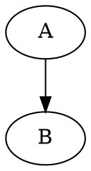

# Diagram (DOT / Graphviz) Feature

DOT / Graphviz 图表支持 Feature（目前为占位实现）。

- 语法：使用围栏代码块：

```markdown



```

- AST：统一解析为 `diagram` 节点，`engine` 为 `dot` 或 `graphviz`。
- 渲染：当前仅占位，RN / Web 端会以文本形式展示代码内容。

