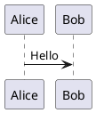

# Diagram (PlantUML) Feature

PlantUML 图表支持 Feature。

- 语法：使用围栏代码块：

```markdown

```plantuml
@startuml
Alice -> Bob: Hello
@enduml
```
```

- AST：统一解析为 `diagram` 节点，`engine` 为 `plantuml`。
- 渲染：通过统一图表子系统调用远端 PlantUML server 生成 SVG。

