# Official Diagram Rendering Test Cases V2

这份文档是第二组官方图表渲染测试用例。它不会覆盖第一组用例，并且所有代码块都与 `official-diagram-rendering-cases.md` 中的旧用例不同。

生成时间：2026-07-01

## 使用方式

1. 将每个“代码”区域中的整个 fenced code block 复制到 Supramark 中测试。
2. 将 Supramark 的渲染结果与本页“官方渲染效果”对比。
3. 自动化时建议检查：渲染成功、关键文本、viewBox、节点形状、连线方向、标签、分组层级。

## 用例总览

| ID | 语言 | 类型 | 覆盖点 | 官方来源 |
| --- | --- | --- | --- | --- |
| `d2-v2-flow-up-direction` | d2 | 最简流程 | Upward directed three-node flow | [source](https://d2lang.com/tour/layouts/) |
| `d2-v2-flow-colored-legend` | d2 | 最简流程 | Three-node flow with colored edges and legend | [source](https://d2lang.com/tour/near/) |
| `d2-v2-flow-grid-process` | d2 | 最简流程 | Grid-based process flow with optional branch | [source](https://d2lang.com/tour/grid-diagrams/) |
| `d2-v2-labeled-arrowheads` | d2 | 带标签连线 | Labeled edges with custom source and target arrowheads | [source](https://d2lang.com/tour/connections/) |
| `d2-v2-labeled-glob-connections` | d2 | 带标签连线 | Glob-generated labeled connections | [source](https://d2lang.com/tour/globs/) |
| `d2-v2-labeled-access-flow` | d2 | 带标签连线 | Access architecture with audited labeled edge | [source](https://d2lang.com/tour/grid-diagrams/) |
| `d2-v2-container-regift` | d2 | 容器/分组 | Cross-container reference with underscore root lookup | [source](https://d2lang.com/tour/containers/) |
| `d2-v2-container-nested-grid` | d2 | 容器/分组 | Nested grid container layout | [source](https://d2lang.com/tour/grid-diagrams/) |
| `d2-v2-container-ml-platform` | d2 | 容器/分组 | Platform graph with explanatory near container | [source](https://d2lang.com/tour/near/) |
| `plantuml-v2-sequence-notes` | plantuml | 时序图示例 | Sequence diagram with notes and return message | [source](https://plantuml.com/sequence-diagram) |
| `plantuml-v2-sequence-create-destroy` | plantuml | 时序图示例 | Sequence diagram with create and destroy lifecycle | [source](https://plantuml.com/sequence-diagram) |
| `plantuml-v2-sequence-critical` | plantuml | 时序图示例 | Sequence diagram with critical section and break | [source](https://plantuml.com/sequence-diagram) |
| `plantuml-v2-class-enum` | plantuml | 类图示例 | Class diagram with enum and composition | [source](https://plantuml.com/class-diagram) |
| `plantuml-v2-class-visibility` | plantuml | 类图示例 | Class diagram with visibility and static members | [source](https://plantuml.com/class-diagram) |
| `plantuml-v2-class-interface` | plantuml | 类图示例 | Class diagram with interface implementation and dependency | [source](https://plantuml.com/class-diagram) |
| `plantuml-v2-activity-while` | plantuml | 活动图示例 | Activity diagram with while loop | [source](https://plantuml.com/activity-diagram-beta) |
| `plantuml-v2-activity-switch` | plantuml | 活动图示例 | Activity diagram with switch branches | [source](https://plantuml.com/activity-diagram-beta) |
| `plantuml-v2-activity-swimlanes` | plantuml | 活动图示例 | Activity diagram with swimlanes | [source](https://plantuml.com/activity-diagram-beta) |
| `mermaid-v2-flowchart-arrow-types` | mermaid | 流程图 | Flowchart with circle, cross, and bidirectional arrows | [source](https://mermaid.js.org/syntax/flowchart.html) |
| `mermaid-v2-flowchart-styled-classes` | mermaid | 流程图 | Flowchart with class definitions and styled nodes | [source](https://mermaid.js.org/syntax/flowchart.html) |
| `mermaid-v2-flowchart-markdown-labels` | mermaid | 流程图 | Flowchart with markdown labels and multiple text lines | [source](https://mermaid.js.org/syntax/flowchart.html) |

| `graphviz-v2-git` | dot | 有向图 | Colored directed concept graph with commit history, refs, checkout, merge, and rebase relationships | [source](https://graphviz.org/Gallery/directed/git.html) |
| `graphviz-v2-switch` | dot | 有向图 | Directed network topology with switch nodes, circular connectors, and multiple fan-out paths | [source](https://graphviz.org/Gallery/directed/switch.html) |
| `graphviz-v2-psg` | dot | 有向图 | Large directed parser state graph with HTML-like labels, highlighted reductions, and weighted edges | [source](https://graphviz.org/Gallery/directed/psg.html) |
| `echarts-v2-area-basic` | echarts | 折线图 | Single line series with areaStyle fill and category/value axes | [source](https://echarts.apache.org/examples/en/editor.html?c=area-basic&renderer=svg) |
| `echarts-v2-area-stack` | echarts | 折线图 | Five stacked line series with filled areas, title, tooltip, legend, and toolbox | [source](https://echarts.apache.org/examples/en/editor.html?c=area-stack&renderer=svg) |
| `echarts-v2-line-step` | echarts | 折线图 | Three step line series with different step modes and legend entries | [source](https://echarts.apache.org/examples/en/editor.html?c=line-step&renderer=svg) |
| `vega-lite-v2-stacked-bar-weather` | vega-lite | 柱状图 | Stacked bar marks by weather category with temporal/month field and color legend | [source](https://vega.github.io/vega-lite/examples/stacked_bar_weather.html) |
| `vega-lite-v2-bar-layered-transparent` | vega-lite | 柱状图 | Bar marks with transparent overlays and gender color grouping | [source](https://vega.github.io/vega-lite/examples/bar_layered_transparent.html) |
| `vega-lite-v2-bar-diverging-population` | vega-lite | 柱状图 | Diverging stacked bars with signed quantitative values, color grouping, and demographic categories | [source](https://vega.github.io/vega-lite/examples/bar_diverging_stack_population_pyramid.html) |

## D2

### 最简流程

#### d2-v2-flow-up-direction: Upward directed three-node flow

官方来源：https://d2lang.com/tour/layouts/

官方源码：https://raw.githubusercontent.com/terrastruct/d2-docs/master/static/d2/direction-up.d2
官方渲染 URL：https://raw.githubusercontent.com/terrastruct/d2-docs/master/static/img/generated/direction-up.svg2

代码（复制下面整个 fenced code block 到 Supramark 中测试）：

````markdown
```d2
direction: up
x -> y -> z: hello
```
````

官方渲染效果：


建议检查文本：`x`, `y`, `z`, `hello`

#### d2-v2-flow-colored-legend: Three-node flow with colored edges and legend

官方来源：https://d2lang.com/tour/near/

官方源码：https://raw.githubusercontent.com/terrastruct/d2-docs/master/static/d2/near-container.d2
官方渲染 URL：https://raw.githubusercontent.com/terrastruct/d2-docs/master/static/img/generated/near-container.svg2

代码（复制下面整个 fenced code block 到 Supramark 中测试）：

````markdown
```d2
direction: right

x -> y: {
  style.stroke: green
}

y -> z: {
  style.stroke: red
}

legend: {
  near: bottom-center
  color1: foo {
    shape: text
    style.font-color: green
  }

  color2: bar {
    shape: text
    style.font-color: red
  }
}
```
````

官方渲染效果：

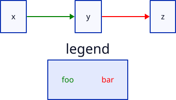

建议检查文本：`x`, `y`, `z`, `legend`, `foo`, `bar`

#### d2-v2-flow-grid-process: Grid-based process flow with optional branch

官方来源：https://d2lang.com/tour/grid-diagrams/

官方源码：https://raw.githubusercontent.com/terrastruct/d2-docs/master/static/d2/grid-connections.d2
官方渲染 URL：https://raw.githubusercontent.com/terrastruct/d2-docs/master/static/img/generated/grid-connections.svg2

代码（复制下面整个 fenced code block 到 Supramark 中测试）：

````markdown
```d2
grid-rows: 4
grid-columns: 5
horizontal-gap: 20
vertical-gap: 5

*.class: [text; blue]

0,0: {
  label: "npm i -g\n@forge/cli"
  style: {
    fill: "#30304c"
    stroke: transparent
    font-color: white
    font: mono
    font-size: 10
    bold: false
  }
}
0,1: {
  label: "Set up an\nAtlassian site"
  class: [text; gray]
}
0,2.class: empty
0,3: {
  label: "View the hello\nworld app"
  class: [text; gray]
}
0,4: forge\ntunnel

1*.class: note
1*.label: ""
1,0
1,1
1,2
1,3
1,4

2,0: forge\nlogin
2,1: forge\ncreate
2,2: forge\ndeploy
2,3: forge\ninstall
2,4: {
  shape: diamond
  label: "Hot reload\nchanges?"
  class: [text; gray]
}

3*.class: note
3,0: Step 1
3,1: Step 2
3,2: Step 3
3,3: Step 4
3,4: ""

4,0: "" {
  grid-rows: 3
  grid-columns: 1
  grid-gap: 0

  class: []

  style: {
    fill: transparent
    stroke: transparent
  }

  *.style: {
    fill: transparent
    stroke: transparent
    font-color: "#30304c"
    font-size: 10
    bold: false
  }
  *.label.near: center-left
  *.height: 20
  a: ⬤ Forge CLI {
    style.font-color: "#0033cc"
  }

  b: ⬤ Required {
    style.font-color: "#30304c"
  }
  c: ⬤ Optional {
    style.font-color: "#cecece"
  }
}
4,1.class: empty
4,2.class: empty
4,3.class: empty
4,4: forge\ndeploy

0,0 -> 2,0 -> 2,1 -> 2,2 -> 2,3 -> 2,4: {
  class: arrow
}
2,1 -> 0,1: {
  class: arrow
  style.stroke: "#cecece"
}
2,3 -> 0,3: {
  class: arrow
  style.stroke: "#cecece"
}
2,4 -> 0,4: Yes {
  class: arrow
  style.font-size: 10
}
2,4 -> 4,4: No {
  class: arrow
  style.font-size: 10
}

classes: {
  text.style: {
    stroke: transparent
    font-color: white
    font: mono
    font-size: 10
    bold: false
  }
  text: {
    width: 100
    height: 60
  }
  blue.style: {
    fill: "#0033cc"
    stroke: "#0033cc"
    border-radius: 10
  }
  gray.style: {
    fill: "#cecece"
    stroke: "#cecece"
    border-radius: 10
  }
  note: {
    height: 30
    label.near: top-center
    style: {
      font-size: 10
      bold: false
      fill: transparent
      stroke: transparent
    }
  }
  empty: {
    label: ""
    width: 50
    height: 50
    style: {
      fill: transparent
      stroke: transparent
    }
  }
  arrow: {
    target-arrowhead.shape: arrow
    style: {
      stroke: black
      stroke-width: 2
    }
  }
}
```
````

官方渲染效果：

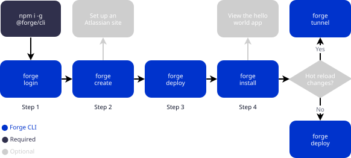

建议检查文本：`forge`, `Step 1`, `Hot reload`, `Yes`, `No`

### 带标签连线

#### d2-v2-labeled-arrowheads: Labeled edges with custom source and target arrowheads

官方来源：https://d2lang.com/tour/connections/

官方源码：https://raw.githubusercontent.com/terrastruct/d2-docs/master/static/d2/connections-5.d2
官方渲染 URL：https://raw.githubusercontent.com/terrastruct/d2-docs/master/static/img/generated/connections-5.svg2

代码（复制下面整个 fenced code block 到 Supramark 中测试）：

````markdown
```d2
a: The best way to avoid responsibility is to say, "I've got responsibilities"
b: Whether weary or unweary, O man, do not rest
c: I still maintain the point that designing a monolithic kernel in 1991 is a

a -> b: To err is human, to moo bovine {
  source-arrowhead: 1
  target-arrowhead: * {
    shape: diamond
  }
}

b <-> c: "Reality is just a crutch for people who can't handle science fiction" {
  source-arrowhead.label: 1
  target-arrowhead: * {
    shape: diamond
    style.filled: true
  }
}

d: A black cat crossing your path signifies that the animal is going somewhere

d -> a -> c
```
````

官方渲染效果：

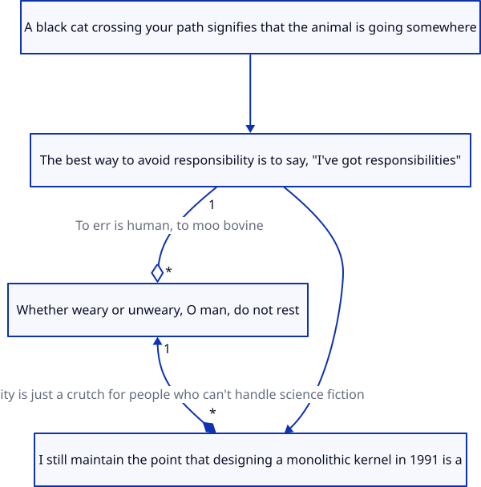

建议检查文本：`To err is human`, `Reality is just a crutch`, `responsibilities`

#### d2-v2-labeled-glob-connections: Glob-generated labeled connections

官方来源：https://d2lang.com/tour/globs/

官方源码：https://raw.githubusercontent.com/terrastruct/d2-docs/master/static/d2/globs-connections.d2
官方渲染 URL：https://raw.githubusercontent.com/terrastruct/d2-docs/master/static/img/generated/globs-connections.svg2

代码（复制下面整个 fenced code block 到 Supramark 中测试）：

````markdown
```d2
vars: {
  d2-config: {
    layout-engine: elk
  }
}

Spiderman 1
Spiderman 2
Spiderman 3

* -> *: 👉
```
````

官方渲染效果：

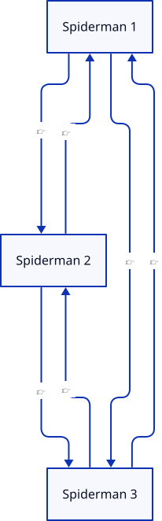

建议检查文本：`Spiderman 1`, `Spiderman 2`, `Spiderman 3`

#### d2-v2-labeled-access-flow: Access architecture with audited labeled edge

官方来源：https://d2lang.com/tour/grid-diagrams/

官方源码：https://raw.githubusercontent.com/terrastruct/d2-docs/master/static/d2/grid-connected.d2
官方渲染 URL：https://raw.githubusercontent.com/terrastruct/d2-docs/master/static/img/generated/grid-connected.svg2

代码（复制下面整个 fenced code block 到 Supramark 中测试）：

````markdown
```d2
direction: right

users -- via -- teleport

teleport -> jita: "all connections audited and logged"
teleport -> infra

teleport -> identity provider
teleport <- identity provider

users: "" {
  grid-columns: 1

  Engineers: {
    shape: circle
    icon: https://icons.terrastruct.com/essentials%2F365-user.svg
  }
  Machines: {
    shape: circle
    icon: https://icons.terrastruct.com/aws%2FCompute%2FCompute.svg
  }
}

via: "" {
  grid-columns: 1

  https: "HTTPS://"
  kubectl: "> kubectl"
  tsh: "> tsh"
  api: "> api"
  db clients: "DB Clients"
}

teleport: Teleport {
  grid-rows: 2

  inp: |md
    # Identity Native Proxy
  | {
    width: 300
  }

  Audit Log.icon: https://icons.terrastruct.com/tech%2Flaptop.svg
  Cert Authority.icon: https://icons.terrastruct.com/azure%2FWeb%20Service%20Color%2FApp%20Service%20Certificates.svg
}

jita: "Just-in-time Access via" {
  grid-rows: 1

  Slack.icon: https://icons.terrastruct.com/dev%2Fslack.svg
  Mattermost
  Jira
  Pagerduty
  Email.icon: https://icons.terrastruct.com/aws%2F_General%2FAWS-Email_light-bg.svg
}

infra: Infrastructure {
  grid-rows: 2

  ssh.icon: https://icons.terrastruct.com/essentials%2F112-server.svg
  Kubernetes.icon: https://icons.terrastruct.com/azure%2F_Companies%2FKubernetes.svg
  My SQL.icon: https://icons.terrastruct.com/dev%2Fmysql.svg
  MongoDB.icon: https://icons.terrastruct.com/dev%2Fmongodb.svg
  PSQL.icon: https://icons.terrastruct.com/dev%2Fpostgresql.svg
  Windows.icon: https://icons.terrastruct.com/dev%2Fwindows.svg
}

identity provider: Identity Provider {
  icon: https://icons.terrastruct.com/azure%2FIdentity%20Service%20Color%2FIdentity%20governance.svg
}
```
````

官方渲染效果：


建议检查文本：`Teleport`, `Just-in-time Access`, `all connections audited and logged`, `Identity Provider`

### 容器/分组

#### d2-v2-container-regift: Cross-container reference with underscore root lookup

官方来源：https://d2lang.com/tour/containers/

官方源码：https://raw.githubusercontent.com/terrastruct/d2-docs/master/static/d2/containers-underscore.d2
官方渲染 URL：https://raw.githubusercontent.com/terrastruct/d2-docs/master/static/img/generated/containers-underscore.svg2

代码（复制下面整个 fenced code block 到 Supramark 中测试）：

````markdown
```d2
christmas: {
  presents
}
birthdays: {
  presents
  _.christmas.presents -> presents: regift
  _.christmas.style.fill: "#ACE1AF"
}
```
````

官方渲染效果：

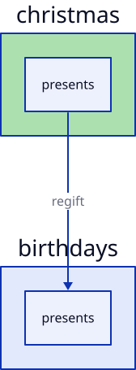

建议检查文本：`christmas`, `birthdays`, `presents`, `regift`

#### d2-v2-container-nested-grid: Nested grid container layout

官方来源：https://d2lang.com/tour/grid-diagrams/

官方源码：https://raw.githubusercontent.com/terrastruct/d2-docs/master/static/d2/grid-nested-grid.d2
官方渲染 URL：https://raw.githubusercontent.com/terrastruct/d2-docs/master/static/img/generated/grid-nested-grid.svg2

代码（复制下面整个 fenced code block 到 Supramark 中测试）：

````markdown
```d2
grid-gap: 0
grid-columns: 1
header
body: "" {
  grid-gap: 0
  grid-columns: 2
  content
  sidebar
}
footer
```
````

官方渲染效果：

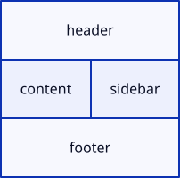

建议检查文本：`header`, `content`, `sidebar`, `footer`

#### d2-v2-container-ml-platform: Platform graph with explanatory near container

官方来源：https://d2lang.com/tour/near/

官方源码：https://raw.githubusercontent.com/terrastruct/d2-docs/master/static/d2/near-explanation.d2
官方渲染 URL：https://raw.githubusercontent.com/terrastruct/d2-docs/master/static/img/generated/near-explanation.svg2

代码（复制下面整个 fenced code block 到 Supramark 中测试）：

````markdown
```d2
explanation: |md
  # LLMs
  The Large Language Model (LLM) is a powerful AI\
    system that learns from vast amounts of text data.\
  By analyzing patterns and structures in language,\
  it gains an understanding of grammar, facts,\
  and even some reasoning abilities. As users input text,\
  the LLM predicts the most likely next words or phrases\
  to create coherent responses. The model\
  continuously fine-tunes its output, considering both the\
  user's input and its own vast knowledge base.\
  This cutting-edge technology enables LLM to generate human-like text,\
  making it a valuable tool for various applications.
| {
  near: center-left
}

ML Platform -> Pre-trained models
ML Platform -> Model registry
ML Platform -> Compiler
ML Platform -> Validation
ML Platform -> Auditing

Model registry -> Server.Batch Predictor
Server.Online Model Server
```
````

官方渲染效果：


建议检查文本：`LLMs`, `ML Platform`, `Model registry`, `Compiler`, `Server`

## PlantUML

### 时序图示例

#### plantuml-v2-sequence-notes: Sequence diagram with notes and return message

官方来源：https://plantuml.com/sequence-diagram

官方渲染 URL：https://www.plantuml.com/plantuml/svg/LOun3i8m54FtdC8NgAWOErGj2274G0Sky6bI6f4cKV83rqTfoS3uxUTlTv4fS5gCy1HOZzgJPHo2-qGL_hH-k0X9J0-A2aSQPoN4ZqFLPhl1-NJ7pWStQQD4FrooiQ8DZ7Elv97osrL2LL9ZFYLApZfM2FevCzoqrc93C6i6lPsM4MM9K5OY9xQwgYtR6-ph6hUhw9ILQJ5V

代码（复制下面整个 fenced code block 到 Supramark 中测试）：

````markdown
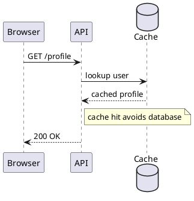
````

官方渲染效果：

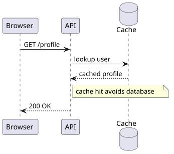

建议检查文本：`Browser`, `API`, `Cache`, `note right`, `cached profile`

#### plantuml-v2-sequence-create-destroy: Sequence diagram with create and destroy lifecycle

官方来源：https://plantuml.com/sequence-diagram

官方渲染 URL：https://www.plantuml.com/plantuml/svg/NOux3eCm40NxFSMMK7012eIKZWkazkSLJeoNhDUASdiKGH7IpZoDtbpDgRKrq-RKKaYRAyQtd53iWkwYJoZHeNYOJZ8oogkXeNk8xoaed84NyNJuxt8HFtB1-vZySMsbwsaHpyDFL55RDegeflAvz8Rf_3Toa7NBC4IQKM9Rymu0

代码（复制下面整个 fenced code block 到 Supramark 中测试）：

````markdown
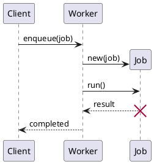
````

官方渲染效果：

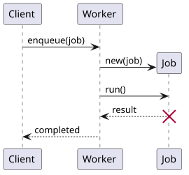

建议检查文本：`Client`, `Worker`, `Job`, `enqueue(job)`, `completed`

#### plantuml-v2-sequence-critical: Sequence diagram with critical section and break

官方来源：https://plantuml.com/sequence-diagram

官方渲染 URL：https://www.plantuml.com/plantuml/svg/PO-nQiH034HxVSLmlN_0nN6TMqF81oYxSx6uzUuXomxErmS731TIg1dUcq6t9THZdOjeYkPuN-ZoL0zBzjGQUADlblWdkuowpwo1GODVkb-W2yP1vB3HNK-fHvgO7cqDIMvXIGkS2tqZh6wiqNmNdFXXZaCFNMDgRjz4Kiy2Z0EwrzOJqB1MOLbO5Y9ivZ45V3ZrWJIfVn9tjSAZvMMdk_u-siCPlgDeq0LWpNBSVwvvfYErUZUVcUN6cjUv_000

代码（复制下面整个 fenced code block 到 Supramark 中测试）：

````markdown
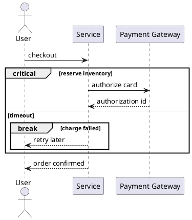
````

官方渲染效果：

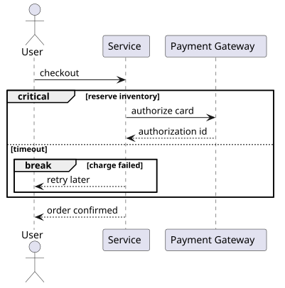

建议检查文本：`Service`, `Payment Gateway`, `critical`, `break`, `charge failed`

### 类图示例

#### plantuml-v2-class-enum: Class diagram with enum and composition

官方来源：https://plantuml.com/class-diagram

官方渲染 URL：https://www.plantuml.com/plantuml/svg/SoWkIImgAStDuKhEIImkLl0lIaajKgZcKb3GpaonKWWDzNG1iKloIn9pD3Ij57ppyr8hkMgHLVjavgL2T1IM9kQLP9PKMYbavfM018fBap1qfkQLva8q1fSabfGMWxNwkOPpAIW4E89j2_Rm30XmTU6gvOAuHajNLq79K4zFImbX8LHALzSEsImkXzIybDBS7000

代码（复制下面整个 fenced code block 到 Supramark 中测试）：

````markdown
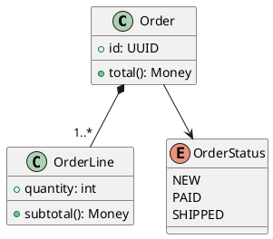
````

官方渲染效果：

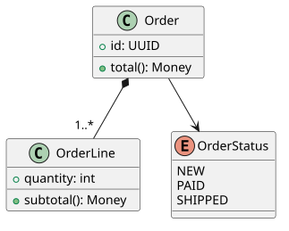

建议检查文本：`Order`, `OrderLine`, `OrderStatus`, `PAID`, `total`

#### plantuml-v2-class-visibility: Class diagram with visibility and static members

官方来源：https://plantuml.com/class-diagram

官方渲染 URL：https://www.plantuml.com/plantuml/svg/JOv12eCm44NtESLVMiGBk2WMkkok9nWdWmII29C9HSIxIqg5RX-F__vKZDHgYeuZbO87yrgpONV0C5Eap3BYAHmIHGVinSW27-YvgahcRSJRDEJ50Jsh-60TfRPnQyJB_0UEN-KbVX7zHdeLNjLtaastPbmFXk5-UIC-6amAcXIak4cohocU

代码（复制下面整个 fenced code block 到 Supramark 中测试）：

````markdown
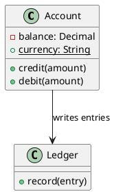
````

官方渲染效果：

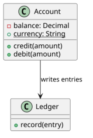

建议检查文本：`Account`, `Ledger`, `balance`, `credit`, `debit`

#### plantuml-v2-class-interface: Class diagram with interface implementation and dependency

官方来源：https://plantuml.com/class-diagram

官方渲染 URL：https://www.plantuml.com/plantuml/svg/NOrH2i9034J_SufyjWXx017f6VG4OHDX8StMJLeerhkBe5ZydE6zcS63MioZGh6GTgCiU96fUedQLdm0ui5faKuiIgpzEsibxWhty8Iiv8xNk_wSRoTjALa0TckdBQK_-8DXIkVzxn5P9Z5sh0Q36C-ZlW00

代码（复制下面整个 fenced code block 到 Supramark 中测试）：

````markdown
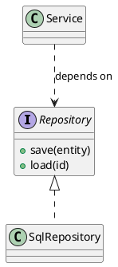
````

官方渲染效果：

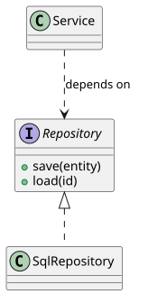

建议检查文本：`Repository`, `SqlRepository`, `Service`, `save`, `load`

### 活动图示例

#### plantuml-v2-activity-while: Activity diagram with while loop

官方来源：https://plantuml.com/activity-diagram-beta

官方渲染 URL：https://www.plantuml.com/plantuml/svg/JOqn3eCm40JxUyML-0kc254QEjvWnIj0EP-Td2t4xn4eaTBDJh4pM0sVsfBG1UId0kLtGqDFsx8AkBiM8vMwtnolnfrcHyn-31e5d60MPlIdkZzVcZT1dFyyD7wlTfWZ_v1i-4Miva83DBOa1m00

代码（复制下面整个 fenced code block 到 Supramark 中测试）：

````markdown
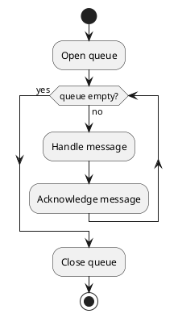
````

官方渲染效果：

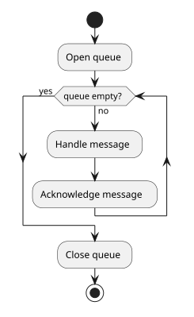

建议检查文本：`Open queue`, `Handle message`, `queue empty?`, `Close queue`

#### plantuml-v2-activity-switch: Activity diagram with switch branches

官方来源：https://plantuml.com/activity-diagram-beta

官方渲染 URL：https://www.plantuml.com/plantuml/svg/DSun3eCm40J0_bvn9JGy08hGfaYA_C2nbs21VPPz1l7xI8HqgzL8ksDHaxM6bSv0_GiMVWFlUCyYoq1bzsfdRh0XAkkHS6l9cW9kaZa2edQbMWiuk9QO-uV92_kuYRVWPBmRBdvrtMJyUjcdg9yEjhMe1EI_59sHJt3_HCdWStmWHFUxGqKbqOZeQbY_

代码（复制下面整个 fenced code block 到 Supramark 中测试）：

````markdown
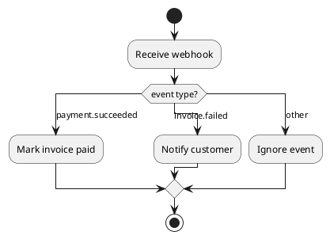
````

官方渲染效果：

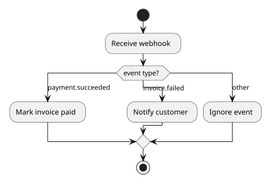

建议检查文本：`Receive webhook`, `payment.succeeded`, `invoice.failed`, `Ignore event`

#### plantuml-v2-activity-swimlanes: Activity diagram with swimlanes

官方来源：https://plantuml.com/activity-diagram-beta

官方渲染 URL：https://www.plantuml.com/plantuml/svg/RSqx2iD038JXNgV8ETQDJI1rY4-mhATOs8Uyabpfy04NTf6q7_mpisWSQhMGFqsqLmodqoXyi1j47xjrnKI-nW9n2ky1ZWENltABBS4fBCoZ7_WfLhJjmlidB2c1zS_G6UHsz9mmaMXdcj4sg-KB

代码（复制下面整个 fenced code block 到 Supramark 中测试）：

````markdown
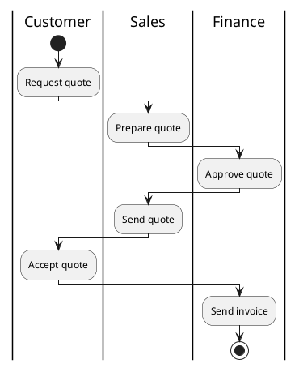
````

官方渲染效果：

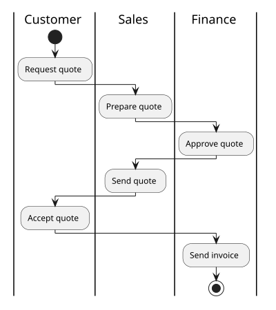

建议检查文本：`Customer`, `Sales`, `Finance`, `Approve quote`, `Send invoice`

## Mermaid

### 流程图

#### mermaid-v2-flowchart-arrow-types: Flowchart with circle, cross, and bidirectional arrows

官方来源：https://mermaid.js.org/syntax/flowchart.html

官方渲染器版本：Mermaid 11.16.0

代码（复制下面整个 fenced code block 到 Supramark 中测试）：

````markdown
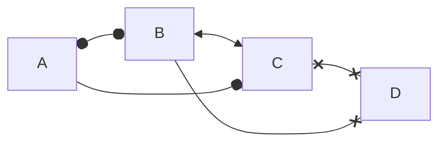
````

官方渲染效果：


建议检查文本：`A`, `B`, `C`, `D`

#### mermaid-v2-flowchart-styled-classes: Flowchart with class definitions and styled nodes

官方来源：https://mermaid.js.org/syntax/flowchart.html

官方渲染器版本：Mermaid 11.16.0

代码（复制下面整个 fenced code block 到 Supramark 中测试）：

````markdown
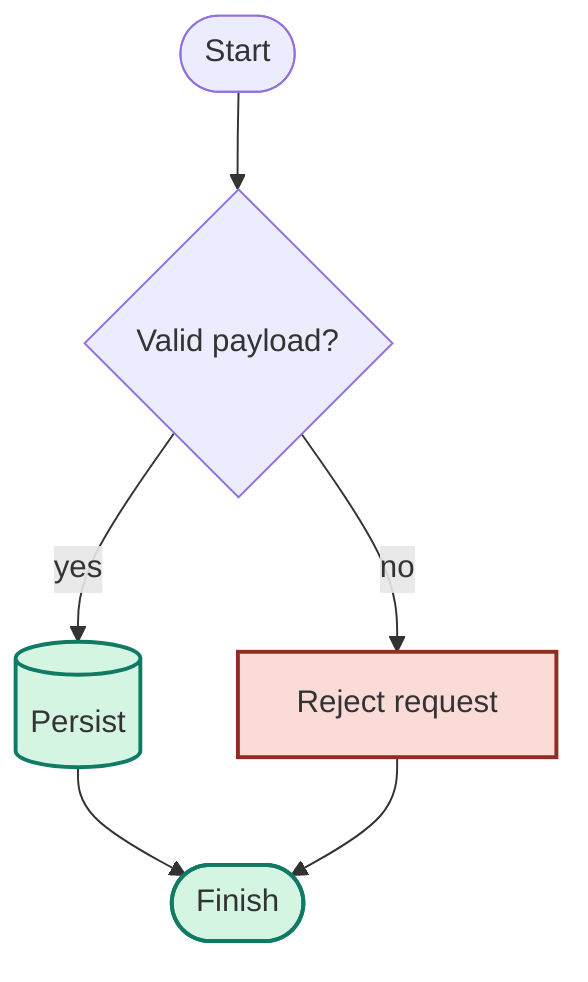
````

官方渲染效果：


建议检查文本：`Start`, `Validate`, `Persist`, `Finish`

#### mermaid-v2-flowchart-markdown-labels: Flowchart with markdown labels and multiple text lines

官方来源：https://mermaid.js.org/syntax/flowchart.html

官方渲染器版本：Mermaid 11.16.0

代码（复制下面整个 fenced code block 到 Supramark 中测试）：

````markdown
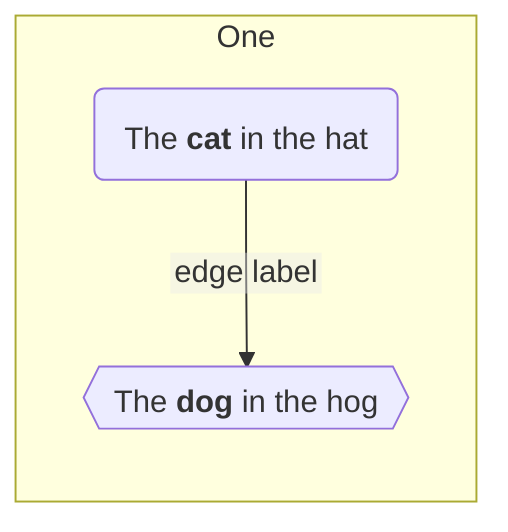
````

官方渲染效果：


建议检查文本：`cat`, `dog`, `edge label`, `One`

## DOT / Graphviz

### 有向图

#### graphviz-v2-git: Basic Git concepts and operations graph

官方来源：https://graphviz.org/Gallery/directed/git.html

官方源码：https://graphviz.org/Gallery/directed/git.gv.txt
官方渲染 URL：https://graphviz.org/Gallery/directed/git.svg

代码（复制下面整个 fenced code block 到 Supramark 中测试）：
````markdown
```dot
digraph git_basics {
	graph [
		label = "Basic git concepts and operations\n\n"
		labelloc = t
		fontname = "Helvetica,Arial,sans-serif"
		fontsize = 20
		layout = dot
		rankdir = LR
		newrank = true
	]
	node [
		style=filled
		shape=rect
		pencolor="#00000044" // frames color
		fontname="Helvetica,Arial,sans-serif"
		shape=plaintext
	]
	edge [
		arrowsize=0.5
		fontname="Helvetica,Arial,sans-serif"
		labeldistance=3
		labelfontcolor="#00000080"
		penwidth=2
		style=dotted // dotted style symbolizes data transfer
	]
	changes [
		color="#88000022"
		label=<<table border="0" cellborder="1" cellspacing="0" cellpadding="4">
			<tr> <td> <b>changes</b><br/>in the working tree </td> </tr>
			<tr> <td align="left"><i>To view: </i><br align="left"/>
			git diff
			<br align="left"/></td> </tr>
		</table>>
		shape=plain
	]
	staging [
		fillcolor="#ff880022"
		label=<<table border="0" cellborder="1" cellspacing="0" cellpadding="4">
			<tr> <td> <b>staging area</b><br/>(cache, index)</td> </tr>
			<tr> <td align="left"><i>To view: </i><br align="left"/>
			git diff --staged
			<br align="left"/></td> </tr>
		</table>>
		shape=plain
	]
	staging -> HEAD:push [label="git commit" weight=1000 color="#88000088"]
	stash [
		fillcolor="#0044ff22"
		label=<<table border="0" cellborder="1" cellspacing="0" cellpadding="4">
			<tr> <td> <b>stash</b></td> </tr>
			<tr> <td align="left"><i>To view:</i><br align="left"/>
			git stash list
			<br align="left"/></td> </tr>
		</table>>
		shape=plain
	]
	stash_push [
		label="git stash [push]"
		style=""
		shape=plain
		color="#00008844"
	]
	{
		edge [arrowhead=none color="#00008844"]
		changes ->  stash_push
		stash_push -> staging
	}
	changes -> stash [
		dir=back
		xlabel="git stash pop"
		color="#00000088" weight=0]
	stash_push -> stash [xdir=back color="#00008844" minlen=0]
	HEAD [
		fillcolor="#88ff0022"
		label=<<table border="0" cellborder="1" cellspacing="0" cellpadding="3">
			<tr> <td port="push" sides="ltr"> <b>HEAD </b>of</td> </tr>
			<tr> <td port="pull" sides="lbr"> the current branch</td> </tr>
			<tr> <td port="switch" align="left">
				<i>To view:</i>
				<br align="left"/>
				git show<br align="left"/>
				git log
				<br align="left"/>
			</td> </tr>
			<tr> <td align="left">
				<i>To change branch:</i><br align="left"/>
				git switch ...
				<br align="left"/>
				git checkout ...
				<br align="left"/>
			</td> </tr>
		</table>>
		shape=plain
	]
	remote [
		label="remote branch"
		shape=box
		color="#00000022"
		fillcolor="#00ff0022"
	]

	HEAD:push -> remote [label="git push" color="#88000088"]
	HEAD:pull -> remote [dir=back label="git pull" color="#00440088"]
	branches [
		fillcolor="#00888822"
		label=<<table border="0" cellborder="1" cellspacing="0" cellpadding="4">
			<tr> <td> <b>local branches</b> </td> </tr>
			<tr> <td align="left"><i>To view:</i><br align="left"/>
			git branch [--list]
			<br align="left"/></td> </tr>
			</table>>
		shape=plain
	]
	changes -> staging [label="git add ...    \ngit reset      " color="#88000088"]
	discard [shape=plaintext style=""]
	changes -> discard [label="git restore ..." color="#88000088"]
	{rank=same changes discard}
	// UML style aggregation
	HEAD:switch -> branches [
		dir=back
		style=""
		penwidth=1
		arrowtail=odiamond
		arrowhead=none
		color="#00000088"
	]
}
// © 2022 Costa Shulyupin, licensed under EPL
```
````

官方渲染效果：


建议检查文本：`git`, `changes`, `staging area`, `HEAD`, `remote branch`

#### graphviz-v2-switch: Switch network graph

官方来源：https://graphviz.org/Gallery/directed/switch.html

官方源码：https://graphviz.org/Gallery/directed/switch.gv.txt
官方渲染 URL：https://graphviz.org/Gallery/directed/switch.svg

代码（复制下面整个 fenced code block 到 Supramark 中测试）：
````markdown
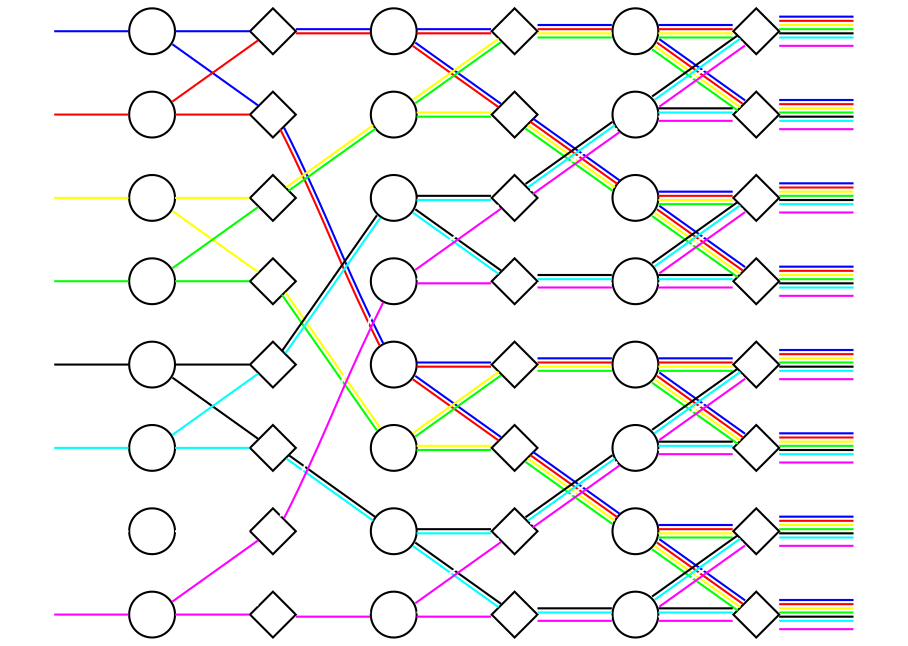
````

官方渲染效果：
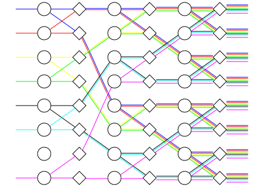

建议检查文本：

#### graphviz-v2-psg: Parsing state graph

官方来源：https://graphviz.org/Gallery/directed/psg.html

官方源码：https://graphviz.org/Gallery/directed/psg.gv.txt
官方渲染 URL：https://graphviz.org/Gallery/directed/psg.svg

代码（复制下面整个 fenced code block 到 Supramark 中测试）：
````markdown
```dot
##"I made a program to generate dot files representing the LR(0) state graph along with computed LALR(1) lookahead for an arbitrary context-free grammar, to make the diagrams I used in this article: http://blog.lab49.com/archives/2471. The program also highlights errant nodes in red if the grammar would produce a shift/reduce or reduce/reduce conflict -- you may be able to go to http://kthielen.dnsalias.com:8082/ to produce a graph more to your liking". Contributed by Kalani Thielen.

##Command to get the layout: "dot -Gsize=10,15 -Tpng thisfile > thisfile.png"

digraph g {
  fontname="Helvetica,Arial,sans-serif"
  node [fontname="Helvetica,Arial,sans-serif"]
  edge [fontname="Helvetica,Arial,sans-serif"]
  graph [fontsize=30 labelloc="t" label="" splines=true overlap=false rankdir = "LR"];
  ratio = auto;
  "state0" [ style = "filled, bold" penwidth = 5 fillcolor = "white" fontname = "Courier New" shape = "Mrecord" label =<<table border="0" cellborder="0" cellpadding="3" bgcolor="white"><tr><td bgcolor="black" align="center" colspan="2"><font color="white">State #0</font></td></tr><tr><td align="left" port="r0">&#40;0&#41; s -&gt; &bull;e $ </td></tr><tr><td align="left" port="r1">&#40;1&#41; e -&gt; &bull;l '=' r </td></tr><tr><td align="left" port="r2">&#40;2&#41; e -&gt; &bull;r </td></tr><tr><td align="left" port="r3">&#40;3&#41; l -&gt; &bull;'*' r </td></tr><tr><td align="left" port="r4">&#40;4&#41; l -&gt; &bull;'n' </td></tr><tr><td align="left" port="r5">&#40;5&#41; r -&gt; &bull;l </td></tr></table>> ];
  "state1" [ style = "filled" penwidth = 1 fillcolor = "white" fontname = "Courier New" shape = "Mrecord" label =<<table border="0" cellborder="0" cellpadding="3" bgcolor="white"><tr><td bgcolor="black" align="center" colspan="2"><font color="white">State #1</font></td></tr><tr><td align="left" port="r3">&#40;3&#41; l -&gt; &bull;'*' r </td></tr><tr><td align="left" port="r3">&#40;3&#41; l -&gt; '*' &bull;r </td></tr><tr><td align="left" port="r4">&#40;4&#41; l -&gt; &bull;'n' </td></tr><tr><td align="left" port="r5">&#40;5&#41; r -&gt; &bull;l </td></tr></table>> ];
  "state2" [ style = "filled" penwidth = 1 fillcolor = "white" fontname = "Courier New" shape = "Mrecord" label =<<table border="0" cellborder="0" cellpadding="3" bgcolor="white"><tr><td bgcolor="black" align="center" colspan="2"><font color="white">State #2</font></td></tr><tr><td align="left" port="r4">&#40;4&#41; l -&gt; 'n' &bull;</td><td bgcolor="grey" align="right">=$</td></tr></table>> ];
  "state3" [ style = "filled" penwidth = 1 fillcolor = "white" fontname = "Courier New" shape = "Mrecord" label =<<table border="0" cellborder="0" cellpadding="3" bgcolor="white"><tr><td bgcolor="black" align="center" colspan="2"><font color="white">State #3</font></td></tr><tr><td align="left" port="r5">&#40;5&#41; r -&gt; l &bull;</td><td bgcolor="grey" align="right">=$</td></tr></table>> ];
  "state4" [ style = "filled" penwidth = 1 fillcolor = "white" fontname = "Courier New" shape = "Mrecord" label =<<table border="0" cellborder="0" cellpadding="3" bgcolor="white"><tr><td bgcolor="black" align="center" colspan="2"><font color="white">State #4</font></td></tr><tr><td align="left" port="r3">&#40;3&#41; l -&gt; '*' r &bull;</td><td bgcolor="grey" align="right">=$</td></tr></table>> ];
  "state5" [ style = "filled" penwidth = 1 fillcolor = "black" fontname = "Courier New" shape = "Mrecord" label =<<table border="0" cellborder="0" cellpadding="3" bgcolor="black"><tr><td bgcolor="black" align="center" colspan="2"><font color="white">State #5</font></td></tr><tr><td align="left" port="r0"><font color="white">&#40;0&#41; s -&gt; e &bull;$ </font></td></tr></table>> ];
  "state6" [ style = "filled" penwidth = 1 fillcolor = "white" fontname = "Courier New" shape = "Mrecord" label =<<table border="0" cellborder="0" cellpadding="3" bgcolor="white"><tr><td bgcolor="black" align="center" colspan="2"><font color="white">State #6</font></td></tr><tr><td align="left" port="r1">&#40;1&#41; e -&gt; l &bull;'=' r </td></tr><tr><td align="left" port="r5">&#40;5&#41; r -&gt; l &bull;</td><td bgcolor="grey" align="right">$</td></tr></table>> ];
  "state7" [ style = "filled" penwidth = 1 fillcolor = "white" fontname = "Courier New" shape = "Mrecord" label =<<table border="0" cellborder="0" cellpadding="3" bgcolor="white"><tr><td bgcolor="black" align="center" colspan="2"><font color="white">State #7</font></td></tr><tr><td align="left" port="r1">&#40;1&#41; e -&gt; l '=' &bull;r </td></tr><tr><td align="left" port="r3">&#40;3&#41; l -&gt; &bull;'*' r </td></tr><tr><td align="left" port="r4">&#40;4&#41; l -&gt; &bull;'n' </td></tr><tr><td align="left" port="r5">&#40;5&#41; r -&gt; &bull;l </td></tr></table>> ];
  "state8" [ style = "filled" penwidth = 1 fillcolor = "white" fontname = "Courier New" shape = "Mrecord" label =<<table border="0" cellborder="0" cellpadding="3" bgcolor="white"><tr><td bgcolor="black" align="center" colspan="2"><font color="white">State #8</font></td></tr><tr><td align="left" port="r1">&#40;1&#41; e -&gt; l '=' r &bull;</td><td bgcolor="grey" align="right">$</td></tr></table>> ];
  "state9" [ style = "filled" penwidth = 1 fillcolor = "white" fontname = "Courier New" shape = "Mrecord" label =<<table border="0" cellborder="0" cellpadding="3" bgcolor="white"><tr><td bgcolor="black" align="center" colspan="2"><font color="white">State #9</font></td></tr><tr><td align="left" port="r2">&#40;2&#41; e -&gt; r &bull;</td><td bgcolor="grey" align="right">$</td></tr></table>> ];
  state0 -> state5 [ penwidth = 5 fontsize = 28 fontcolor = "black" label = "e" ];
  state0 -> state6 [ penwidth = 5 fontsize = 28 fontcolor = "black" label = "l" ];
  state0 -> state9 [ penwidth = 5 fontsize = 28 fontcolor = "black" label = "r" ];
  state0 -> state1 [ penwidth = 1 fontsize = 14 fontcolor = "grey28" label = "'*'" ];
  state0 -> state2 [ penwidth = 1 fontsize = 14 fontcolor = "grey28" label = "'n'" ];
  state1 -> state1 [ penwidth = 1 fontsize = 14 fontcolor = "grey28" label = "'*'" ];
  state1 -> state4 [ penwidth = 5 fontsize = 28 fontcolor = "black" label = "r" ];
  state1 -> state2 [ penwidth = 1 fontsize = 14 fontcolor = "grey28" label = "'n'" ];
  state1 -> state3 [ penwidth = 5 fontsize = 28 fontcolor = "black" label = "l" ];
  state6 -> state7 [ penwidth = 1 fontsize = 14 fontcolor = "grey28" label = "'='" ];
  state7 -> state8 [ penwidth = 5 fontsize = 28 fontcolor = "black" label = "r" ];
  state7 -> state1 [ penwidth = 1 fontsize = 14 fontcolor = "grey28" label = "'*'" ];
  state7 -> state2 [ penwidth = 1 fontsize = 14 fontcolor = "grey28" label = "'n'" ];
  state7 -> state3 [ penwidth = 5 fontsize = 28 fontcolor = "black" label = "l" ];
}
```
````

官方渲染效果：
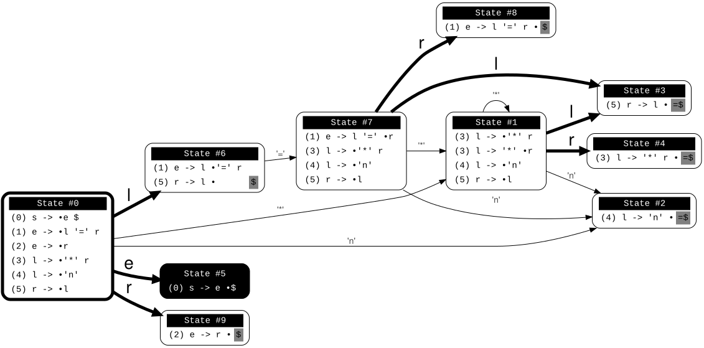

建议检查文本：`State #0`, `State #1`, `State #5`, `State #9`


## ECharts

### 折线图

#### echarts-v2-area-basic: Basic area line chart

官方来源：https://echarts.apache.org/examples/en/editor.html?c=area-basic&renderer=svg

官方源码（JS option）：https://echarts.apache.org/examples/en/editor.html?c=area-basic&renderer=svg
官方渲染 URL：https://echarts.apache.org/examples/en/editor.html?c=area-basic&renderer=svg
官方渲染器版本：Apache ECharts 6.1.0（官网 editor iframe 中暴露的 `echarts.version`）

说明：Supramark 的 ECharts engine 解析 JSON，因此这里使用从官方 JS `option` 等价转换出的 JSON。

代码（复制下面整个 fenced code block 到 Supramark 中测试）：
````markdown
```echarts
{
  "xAxis": {
    "type": "category",
    "boundaryGap": false,
    "data": [
      "Mon",
      "Tue",
      "Wed",
      "Thu",
      "Fri",
      "Sat",
      "Sun"
    ]
  },
  "yAxis": {
    "type": "value"
  },
  "series": [
    {
      "data": [
        820,
        932,
        901,
        934,
        1290,
        1330,
        1320
      ],
      "type": "line",
      "areaStyle": {}
    }
  ]
}
```
````

官方渲染效果：
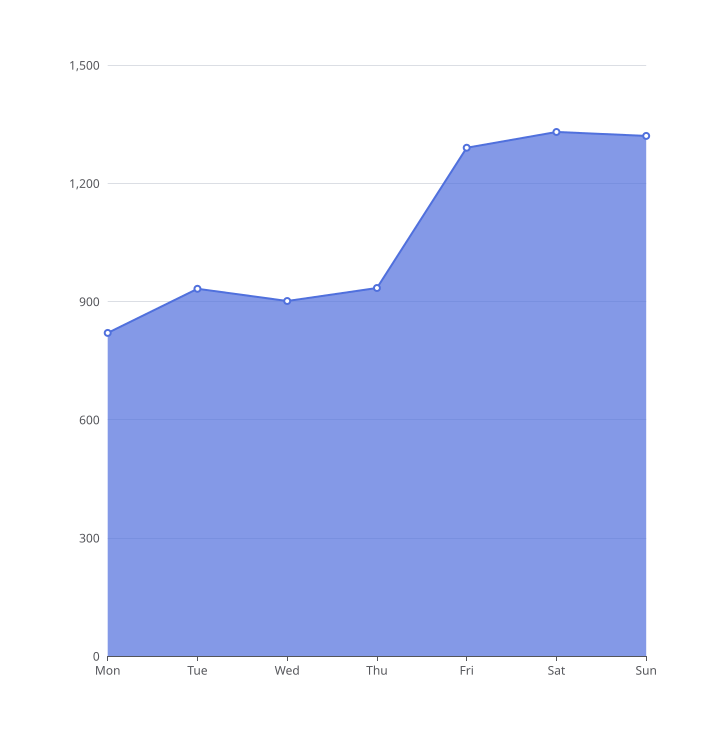

建议检查文本：`Mon`, `Tue`, `Sun`, `areaStyle`, `820`

#### echarts-v2-area-stack: Stacked area line chart

官方来源：https://echarts.apache.org/examples/en/editor.html?c=area-stack&renderer=svg

官方源码（JS option）：https://echarts.apache.org/examples/en/editor.html?c=area-stack&renderer=svg
官方渲染 URL：https://echarts.apache.org/examples/en/editor.html?c=area-stack&renderer=svg
官方渲染器版本：Apache ECharts 6.1.0（官网 editor iframe 中暴露的 `echarts.version`）

说明：Supramark 的 ECharts engine 解析 JSON，因此这里使用从官方 JS `option` 等价转换出的 JSON。

代码（复制下面整个 fenced code block 到 Supramark 中测试）：
````markdown
```echarts
{
  "title": {
    "text": "Stacked Area Chart"
  },
  "tooltip": {
    "trigger": "axis",
    "axisPointer": {
      "type": "cross",
      "label": {
        "backgroundColor": "#6a7985"
      }
    }
  },
  "legend": {
    "data": [
      "Email",
      "Union Ads",
      "Video Ads",
      "Direct",
      "Search Engine"
    ]
  },
  "toolbox": {
    "feature": {
      "saveAsImage": {}
    }
  },
  "xAxis": [
    {
      "type": "category",
      "boundaryGap": false,
      "data": [
        "Mon",
        "Tue",
        "Wed",
        "Thu",
        "Fri",
        "Sat",
        "Sun"
      ]
    }
  ],
  "yAxis": [
    {
      "type": "value"
    }
  ],
  "series": [
    {
      "name": "Email",
      "type": "line",
      "stack": "Total",
      "areaStyle": {},
      "emphasis": {
        "focus": "series"
      },
      "data": [
        120,
        132,
        101,
        134,
        90,
        230,
        210
      ]
    },
    {
      "name": "Union Ads",
      "type": "line",
      "stack": "Total",
      "areaStyle": {},
      "emphasis": {
        "focus": "series"
      },
      "data": [
        220,
        182,
        191,
        234,
        290,
        330,
        310
      ]
    },
    {
      "name": "Video Ads",
      "type": "line",
      "stack": "Total",
      "areaStyle": {},
      "emphasis": {
        "focus": "series"
      },
      "data": [
        150,
        232,
        201,
        154,
        190,
        330,
        410
      ]
    },
    {
      "name": "Direct",
      "type": "line",
      "stack": "Total",
      "areaStyle": {},
      "emphasis": {
        "focus": "series"
      },
      "data": [
        320,
        332,
        301,
        334,
        390,
        330,
        320
      ]
    },
    {
      "name": "Search Engine",
      "type": "line",
      "stack": "Total",
      "label": {
        "show": true,
        "position": "top"
      },
      "areaStyle": {},
      "emphasis": {
        "focus": "series"
      },
      "data": [
        820,
        932,
        901,
        934,
        1290,
        1330,
        1320
      ]
    }
  ]
}
```
````

官方渲染效果：
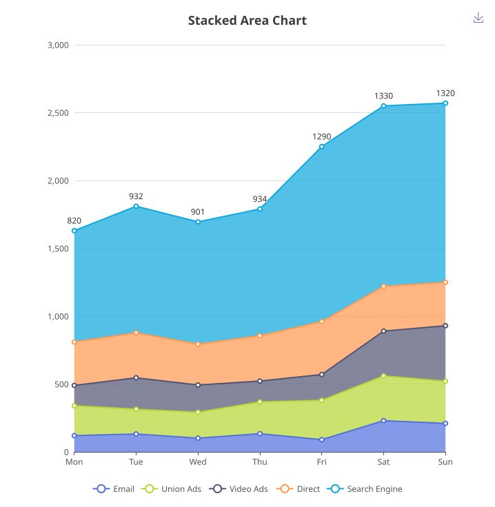

建议检查文本：`Stacked Area Chart`, `Email`, `Union Ads`, `Search Engine`, `areaStyle`

#### echarts-v2-line-step: Step line chart

官方来源：https://echarts.apache.org/examples/en/editor.html?c=line-step&renderer=svg

官方源码（JS option）：https://echarts.apache.org/examples/en/editor.html?c=line-step&renderer=svg
官方渲染 URL：https://echarts.apache.org/examples/en/editor.html?c=line-step&renderer=svg
官方渲染器版本：Apache ECharts 6.1.0（官网 editor iframe 中暴露的 `echarts.version`）

说明：Supramark 的 ECharts engine 解析 JSON，因此这里使用从官方 JS `option` 等价转换出的 JSON。

代码（复制下面整个 fenced code block 到 Supramark 中测试）：
````markdown
```echarts
{
  "title": {
    "text": "Step Line"
  },
  "tooltip": {
    "trigger": "axis"
  },
  "legend": {
    "data": [
      "Step Start",
      "Step Middle",
      "Step End"
    ]
  },
  "grid": {
    "left": "3%",
    "right": "4%",
    "bottom": "3%",
    "containLabel": true
  },
  "toolbox": {
    "feature": {
      "saveAsImage": {}
    }
  },
  "xAxis": {
    "type": "category",
    "data": [
      "Mon",
      "Tue",
      "Wed",
      "Thu",
      "Fri",
      "Sat",
      "Sun"
    ]
  },
  "yAxis": {
    "type": "value"
  },
  "series": [
    {
      "name": "Step Start",
      "type": "line",
      "step": "start",
      "data": [
        120,
        132,
        101,
        134,
        90,
        230,
        210
      ]
    },
    {
      "name": "Step Middle",
      "type": "line",
      "step": "middle",
      "data": [
        220,
        282,
        201,
        234,
        290,
        430,
        410
      ]
    },
    {
      "name": "Step End",
      "type": "line",
      "step": "end",
      "data": [
        450,
        432,
        401,
        454,
        590,
        530,
        510
      ]
    }
  ]
}
```
````

官方渲染效果：
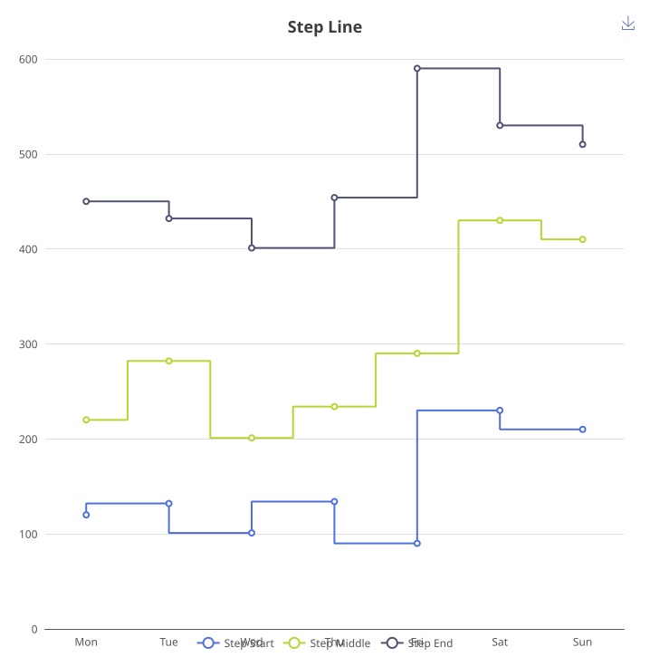

建议检查文本：`Step Start`, `Step Middle`, `Step End`, `step`, `Mon`


## Vega-Lite

### 柱状图

#### vega-lite-v2-stacked-bar-weather: Stacked weather bar chart

官方来源：https://vega.github.io/vega-lite/examples/stacked_bar_weather.html

官方源码（Vega-Lite JSON Specification）：https://vega.github.io/vega-lite/examples/stacked_bar_weather.html
官方渲染 URL：https://vega.github.io/vega-lite/examples/stacked_bar_weather.html
官方渲染器版本：Vega-Lite v6 schema（官方 example 页面 JSON 中的 `$schema`）

说明：若官方 spec 使用 `data/...` 相对数据路径，这里展开为 `https://vega.github.io/vega-lite/data/...`，避免粘到 Supramark 页面后按 Supramark 域名解析导致数据 404。

代码（复制下面整个 fenced code block 到 Supramark 中测试）：
````markdown
```vega-lite
{
  "$schema": "https://vega.github.io/schema/vega-lite/v6.json",
  "data": {
    "url": "https://vega.github.io/vega-lite/data/seattle-weather.csv"
  },
  "mark": "bar",
  "encoding": {
    "x": {
      "timeUnit": "month",
      "field": "date",
      "type": "ordinal",
      "title": "Month of the year"
    },
    "y": {
      "aggregate": "count",
      "type": "quantitative"
    },
    "color": {
      "field": "weather",
      "type": "nominal",
      "scale": {
        "domain": [
          "sun",
          "fog",
          "drizzle",
          "rain",
          "snow"
        ],
        "range": [
          "#e7ba52",
          "#c7c7c7",
          "#aec7e8",
          "#1f77b4",
          "#9467bd"
        ]
      },
      "title": "Weather type"
    }
  }
}
```
````

官方渲染效果：
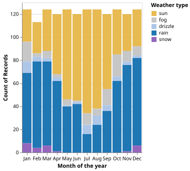

建议检查文本：`weather`, `count`, `sun`, `rain`, `snow`

#### vega-lite-v2-bar-layered-transparent: Layered transparent bar chart

官方来源：https://vega.github.io/vega-lite/examples/bar_layered_transparent.html

官方源码（Vega-Lite JSON Specification）：https://vega.github.io/vega-lite/examples/bar_layered_transparent.html
官方渲染 URL：https://vega.github.io/vega-lite/examples/bar_layered_transparent.html
官方渲染器版本：Vega-Lite v6 schema（官方 example 页面 JSON 中的 `$schema`）

说明：若官方 spec 使用 `data/...` 相对数据路径，这里展开为 `https://vega.github.io/vega-lite/data/...`，避免粘到 Supramark 页面后按 Supramark 域名解析导致数据 404。

代码（复制下面整个 fenced code block 到 Supramark 中测试）：
````markdown
```vega-lite
{
  "$schema": "https://vega.github.io/schema/vega-lite/v6.json",
  "description": "A bar chart showing the US population distribution of age groups and gender in 2000.",
  "data": {
    "url": "https://vega.github.io/vega-lite/data/population.json"
  },
  "transform": [
    {
      "filter": "datum.year == 2000"
    },
    {
      "calculate": "datum.sex == 2 ? 'Female' : 'Male'",
      "as": "gender"
    }
  ],
  "width": {
    "step": 17
  },
  "mark": "bar",
  "encoding": {
    "x": {
      "field": "age",
      "type": "ordinal"
    },
    "y": {
      "aggregate": "sum",
      "field": "people",
      "title": "population",
      "stack": null
    },
    "color": {
      "field": "gender",
      "scale": {
        "range": [
          "#675193",
          "#ca8861"
        ]
      }
    },
    "opacity": {
      "value": 0.7
    }
  }
}
```
````

官方渲染效果：
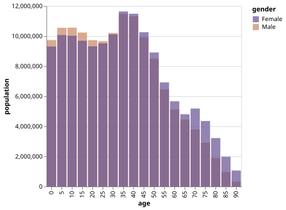

建议检查文本：`population`, `gender`, `Female`, `Male`, `opacity`

#### vega-lite-v2-bar-diverging-population: Diverging stacked population pyramid

官方来源：https://vega.github.io/vega-lite/examples/bar_diverging_stack_population_pyramid.html

官方源码（Vega-Lite JSON Specification）：https://vega.github.io/vega-lite/examples/bar_diverging_stack_population_pyramid.html
官方渲染 URL：https://vega.github.io/vega-lite/examples/bar_diverging_stack_population_pyramid.html
官方渲染器版本：Vega-Lite v6 schema（官方 example 页面 JSON 中的 `$schema`）

说明：若官方 spec 使用 `data/...` 相对数据路径，这里展开为 `https://vega.github.io/vega-lite/data/...`，避免粘到 Supramark 页面后按 Supramark 域名解析导致数据 404。

代码（复制下面整个 fenced code block 到 Supramark 中测试）：
````markdown
```vega-lite
{
  "$schema": "https://vega.github.io/schema/vega-lite/v6.json",
  "description": "A population pyramid for the US in 2000, created using stack. See https://vega.github.io/vega-lite/examples/concat_population_pyramid.html for a variant of this created using concat.",
  "data": {
    "url": "https://vega.github.io/vega-lite/data/population.json"
  },
  "transform": [
    {
      "filter": "datum.year == 2000"
    },
    {
      "calculate": "datum.sex == 2 ? 'Female' : 'Male'",
      "as": "gender"
    },
    {
      "calculate": "datum.sex == 2 ? -datum.people : datum.people",
      "as": "signed_people"
    }
  ],
  "width": 300,
  "height": 200,
  "mark": "bar",
  "encoding": {
    "y": {
      "field": "age",
      "axis": null,
      "sort": "descending"
    },
    "x": {
      "aggregate": "sum",
      "field": "signed_people",
      "title": "population",
      "axis": {
        "format": "s"
      }
    },
    "color": {
      "field": "gender",
      "scale": {
        "range": [
          "#675193",
          "#ca8861"
        ]
      },
      "legend": {
        "orient": "top",
        "title": null
      }
    }
  },
  "config": {
    "view": {
      "stroke": null
    },
    "axis": {
      "grid": false
    }
  }
}
```
````

官方渲染效果：
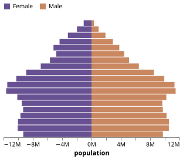

建议检查文本：`age`, `gender`, `people`, `signed_people`, `Female`
