# Official Diagram Rendering Test Cases

这份文档整理 D2、PlantUML、Mermaid 官方文档中的典型代码片段，并附上官方渲染器/官方文档站产生的参考 SVG。用途是把 Supramark 的渲染结果与外部官方结果对比，而不是与 Supramark 自己的产物互相比较。

生成时间：2026-07-01

## 使用方式

1. 将每个代码块粘贴到 Supramark 对应图表语言的 fenced code block 中。
2. 将 Supramark 渲染出的 SVG/截图与本页“官方渲染效果”对比。
3. 自动化时建议至少检查：是否成功渲染、关键文本是否存在、viewBox 是否包含可见元素、主要形状/箭头/分组是否和官方一致。

## 用例总览

| ID | 语言 | 类型 | 覆盖点 | 官方来源 |
| --- | --- | --- | --- | --- |
| `d2-flow-replicas` | d2 | 最简流程 | Replica flow with directed and bidirectional links | [source](https://d2lang.com/tour/connections/) |
| `d2-flow-chain-repeat` | d2 | 最简流程 | Four-stage chained flow with repeat edge | [source](https://d2lang.com/tour/connections/) |
| `d2-flow-direction-right` | d2 | 最简流程 | Three-node directed flow with explicit layout direction | [source](https://d2lang.com/tour/layouts/) |
| `d2-labeled-duplicate-connections` | d2 | 带标签连线 | Repeated Database to S3 edges with a label | [source](https://d2lang.com/tour/connections/) |
| `d2-labeled-chain` | d2 | 带标签连线 | Connection chain sharing one label | [source](https://d2lang.com/tour/connections/) |
| `d2-labeled-indexed-connections` | d2 | 带标签连线 | Two labeled connections between the same endpoints | [source](https://d2lang.com/tour/connections/) |
| `d2-container-nested-paths` | d2 | 容器/分组 | Nested containers declared through dotted paths | [source](https://d2lang.com/tour/containers/) |
| `d2-container-clouds` | d2 | 容器/分组 | Nested cloud provider groups with internal edges | [source](https://d2lang.com/tour/containers/) |
| `d2-container-cross-group-edges` | d2 | 容器/分组 | Labeled containers with cross-group edges | [source](https://d2lang.com/tour/containers/) |
| `plantuml-sequence-basic-messages` | plantuml | 时序图示例 | Sequence diagram with multiple request and response arrows | [source](https://plantuml.com/sequence-diagram) |
| `plantuml-sequence-grouping` | plantuml | 时序图示例 | PlantUML sequence with grouped branches and loop | [source](https://plantuml.com/sequence-diagram) |
| `plantuml-sequence-participants` | plantuml | 时序图示例 | Sequence diagram with participant declarations and return arrow | [source](https://plantuml.com/sequence-diagram) |
| `plantuml-class-relations` | plantuml | 类图示例 | PlantUML class diagram with cardinality and labels | [source](https://plantuml.com/class-diagram) |
| `plantuml-class-members` | plantuml | 类图示例 | Class diagram with attributes, methods, abstract class, and interface | [source](https://plantuml.com/class-diagram) |
| `plantuml-class-packages` | plantuml | 类图示例 | Class diagram with packages and dependencies | [source](https://plantuml.com/class-diagram) |
| `plantuml-activity-conditional` | plantuml | 活动图示例 | PlantUML activity diagram with conditional branch | [source](https://plantuml.com/activity-diagram-beta) |
| `plantuml-activity-repeat` | plantuml | 活动图示例 | Activity diagram with repeat loop | [source](https://plantuml.com/activity-diagram-beta) |
| `plantuml-activity-partitions` | plantuml | 活动图示例 | Activity diagram with partitions and synchronization | [source](https://plantuml.com/activity-diagram-beta) |
| `mermaid-flowchart-decision` | mermaid | 流程图 | Mermaid flowchart with decision loop and labeled edges | [source](https://mermaid.js.org/syntax/flowchart.html) |
| `mermaid-flowchart-shapes` | mermaid | 流程图 | Mermaid flowchart with common node shapes | [source](https://mermaid.js.org/syntax/flowchart.html) |
| `mermaid-flowchart-subgraph` | mermaid | 流程图 | Mermaid flowchart with subgraphs and cross-group edges | [source](https://mermaid.js.org/syntax/flowchart.html) |

| `graphviz-fsm` | dot | 有向图 | Finite-state machine with LR rank direction, double-circle accepting states, self loops, and labeled directed edges | [source](https://graphviz.org/Gallery/directed/fsm.html) |
| `graphviz-cluster` | dot | 有向图 | Two subgraph clusters with filled styles, Mdiamond/Msquare terminal nodes, and cross-cluster directed edges | [source](https://graphviz.org/Gallery/directed/cluster.html) |
| `graphviz-datastruct` | dot | 有向图 | Record labels, nested fields, ports, and pointer-like directed edges between records | [source](https://graphviz.org/Gallery/directed/datastruct.html) |
| `echarts-line-simple` | echarts | 折线图 | Single line series, category x-axis, value y-axis, and seven data points | [source](https://echarts.apache.org/examples/en/editor.html?c=line-simple&renderer=svg) |
| `echarts-line-smooth` | echarts | 折线图 | Single smooth line series with category axis and curved SVG path | [source](https://echarts.apache.org/examples/en/editor.html?c=line-smooth&renderer=svg) |
| `echarts-line-stack` | echarts | 折线图 | Title, tooltip, legend, toolbox, five stacked line series, and category axis | [source](https://echarts.apache.org/examples/en/editor.html?c=line-stack&renderer=svg) |
| `vega-lite-bar-simple` | vega-lite | 柱状图 | Bar mark with embedded data, nominal x field, quantitative y field, and horizontal x labels | [source](https://vega.github.io/vega-lite/examples/bar.html) |
| `vega-lite-bar-aggregate` | vega-lite | 柱状图 | Bar mark with aggregate count encoding and nominal grouping | [source](https://vega.github.io/vega-lite/examples/bar_aggregate.html) |
| `vega-lite-bar-grouped` | vega-lite | 柱状图 | Grouped bars using offset encoding and color grouping | [source](https://vega.github.io/vega-lite/examples/bar_grouped.html) |

## D2

### 最简流程

#### d2-flow-replicas: Replica flow with directed and bidirectional links

官方来源：https://d2lang.com/tour/connections/

官方源码：https://raw.githubusercontent.com/terrastruct/d2-docs/master/static/d2/connections-1.d2
官方渲染 URL：https://raw.githubusercontent.com/terrastruct/d2-docs/master/static/img/generated/connections-1.svg2

代码（复制下面整个 fenced code block 到 Supramark 中测试）：

````markdown
```d2
Write Replica Canada <-> Write Replica Australia

Read Replica <- Master

x -- y

super long shape id here -> super long shape id even longer here
```
````

官方渲染效果：

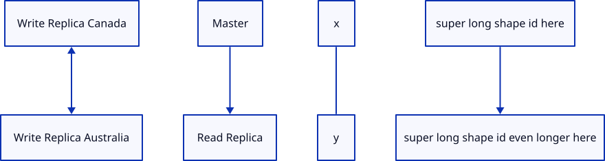

建议检查文本：`Write Replica Canada`, `Write Replica Australia`, `Read Replica`, `Master`

#### d2-flow-chain-repeat: Four-stage chained flow with repeat edge

官方来源：https://d2lang.com/tour/connections/

官方源码：https://raw.githubusercontent.com/terrastruct/d2-docs/master/static/d2/connections-4.d2
官方渲染 URL：https://raw.githubusercontent.com/terrastruct/d2-docs/master/static/img/generated/connections-4.svg2

代码（复制下面整个 fenced code block 到 Supramark 中测试）：

````markdown
```d2
Stage One -> Stage Two -> Stage Three -> Stage Four
Stage Four -> Stage One: repeat
```
````

官方渲染效果：

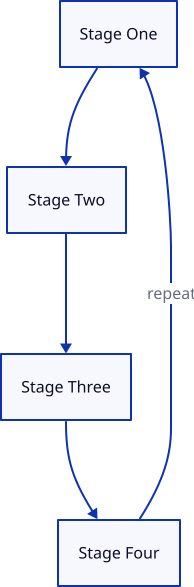

建议检查文本：`Stage One`, `Stage Two`, `Stage Three`, `Stage Four`, `repeat`

#### d2-flow-direction-right: Three-node directed flow with explicit layout direction

官方来源：https://d2lang.com/tour/layouts/

官方源码：https://raw.githubusercontent.com/terrastruct/d2-docs/master/static/d2/direction-right.d2
官方渲染 URL：https://raw.githubusercontent.com/terrastruct/d2-docs/master/static/img/generated/direction-right.svg2

代码（复制下面整个 fenced code block 到 Supramark 中测试）：

````markdown
```d2
direction: right
x -> y -> z: hello
```
````

官方渲染效果：

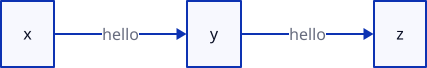

建议检查文本：`x`, `y`, `z`, `hello`

### 带标签连线

#### d2-labeled-duplicate-connections: Repeated Database to S3 edges with a label

官方来源：https://d2lang.com/tour/connections/

官方源码：https://raw.githubusercontent.com/terrastruct/d2-docs/master/static/d2/connections-2.d2
官方渲染 URL：https://raw.githubusercontent.com/terrastruct/d2-docs/master/static/img/generated/connections-2.svg2

代码（复制下面整个 fenced code block 到 Supramark 中测试）：

````markdown
```d2
Database -> S3: backup
Database -> S3
Database -> S3: backup
```
````

官方渲染效果：

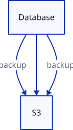

建议检查文本：`Database`, `S3`, `backup`

#### d2-labeled-chain: Connection chain sharing one label

官方来源：https://d2lang.com/tour/connections/

官方源码：https://raw.githubusercontent.com/terrastruct/d2-docs/master/static/d2/connections-3.d2
官方渲染 URL：https://raw.githubusercontent.com/terrastruct/d2-docs/master/static/img/generated/connections-3.svg2

代码（复制下面整个 fenced code block 到 Supramark 中测试）：

````markdown
```d2
# The label applies to each connection in the chain.
High Mem Instance -> EC2 <- High CPU Instance: Hosted By
```
````

官方渲染效果：

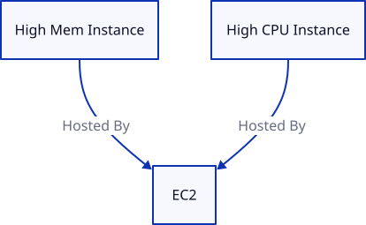

建议检查文本：`High Mem Instance`, `EC2`, `High CPU Instance`, `Hosted By`

#### d2-labeled-indexed-connections: Two labeled connections between the same endpoints

官方来源：https://d2lang.com/tour/connections/

官方源码：https://raw.githubusercontent.com/terrastruct/d2-docs/master/static/d2/connections-reference.d2
官方渲染 URL：https://raw.githubusercontent.com/terrastruct/d2-docs/master/static/img/generated/connections-reference.svg2

代码（复制下面整个 fenced code block 到 Supramark 中测试）：

````markdown
```d2
x -> y: hi
x -> y: hello

(x -> y)[0].style.stroke: red
(x -> y)[1].style.stroke: blue
```
````

官方渲染效果：

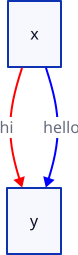

建议检查文本：`x`, `y`, `hi`, `hello`

### 容器/分组

#### d2-container-nested-paths: Nested containers declared through dotted paths

官方来源：https://d2lang.com/tour/containers/

官方源码：https://raw.githubusercontent.com/terrastruct/d2-docs/master/static/d2/containers-1.d2
官方渲染 URL：https://raw.githubusercontent.com/terrastruct/d2-docs/master/static/img/generated/containers-1.svg2

代码（复制下面整个 fenced code block 到 Supramark 中测试）：

````markdown
```d2
server
# Declares a shape inside of another shape
server.process

# Can declare the container and child in same line
im a parent.im a child

# Since connections can also declare keys, this works too
apartment.Bedroom.Bathroom -> office.Spare Room.Bathroom: Portal
```
````

官方渲染效果：

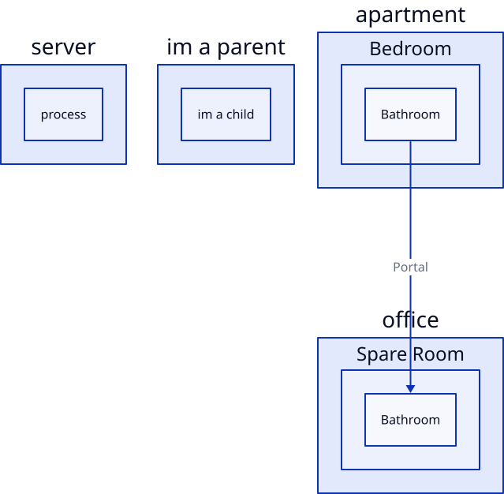

建议检查文本：`server`, `process`, `apartment`, `office`, `Portal`

#### d2-container-clouds: Nested cloud provider groups with internal edges

官方来源：https://d2lang.com/tour/containers/

官方源码：https://raw.githubusercontent.com/terrastruct/d2-docs/master/static/d2/containers-2.d2
官方渲染 URL：https://raw.githubusercontent.com/terrastruct/d2-docs/master/static/img/generated/containers-2.svg2

代码（复制下面整个 fenced code block 到 Supramark 中测试）：

````markdown
```d2
clouds: {
  aws: {
    load_balancer -> api
    api -> db
  }
  gcloud: {
    auth -> db
  }

  gcloud -> aws
}
```
````

官方渲染效果：

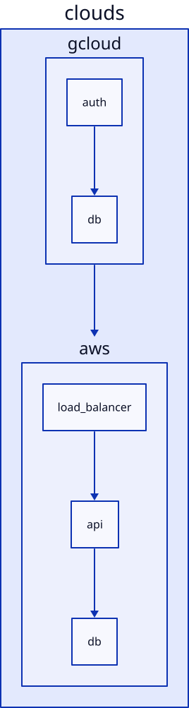

建议检查文本：`clouds`, `aws`, `gcloud`, `load_balancer`, `auth`

#### d2-container-cross-group-edges: Labeled containers with cross-group edges

官方来源：https://d2lang.com/tour/containers/

官方源码：https://raw.githubusercontent.com/terrastruct/d2-docs/master/static/d2/containers-3.d2
官方渲染 URL：https://raw.githubusercontent.com/terrastruct/d2-docs/master/static/img/generated/containers-3.svg2

代码（复制下面整个 fenced code block 到 Supramark 中测试）：

````markdown
```d2
clouds: {
  aws: AWS {
    load_balancer -> api
    api -> db
  }
  gcloud: Google Cloud {
    auth -> db
  }

  gcloud -> aws
}

users -> clouds.aws.load_balancer
users -> clouds.gcloud.auth

ci.deploys -> clouds
```
````

官方渲染效果：

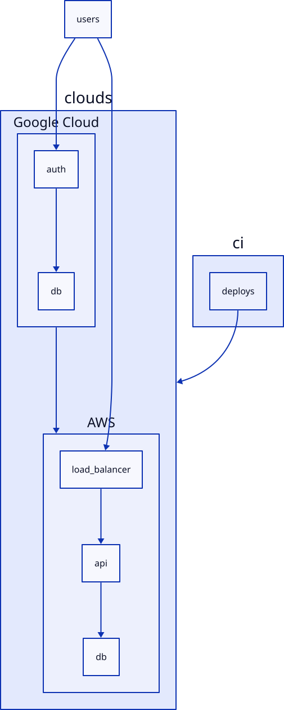

建议检查文本：`clouds`, `AWS`, `Google Cloud`, `users`, `ci`

## PlantUML

### 时序图示例

#### plantuml-sequence-basic-messages: Sequence diagram with multiple request and response arrows

官方来源：https://plantuml.com/sequence-diagram

官方渲染 URL：https://www.plantuml.com/plantuml/svg/XSpH2O0W403G_wQu1Mw1Y4X7Q0Er0mMzAptt3wgl2Ff_lAMfgzfB7anEWG1diE97C5qZiQRWD0d3IaUdfeCL3uWpNFX3jLsuqVjYqKWLtFTvumdnHp_tGhpraay0

代码（复制下面整个 fenced code block 到 Supramark 中测试）：

````markdown
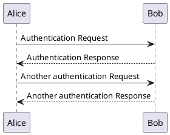
````

官方渲染效果：

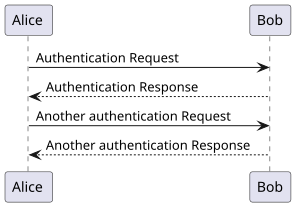

建议检查文本：`Alice`, `Bob`, `Authentication Request`, `Authentication Response`

#### plantuml-sequence-grouping: PlantUML sequence with grouped branches and loop

官方来源：https://plantuml.com/sequence-diagram

官方渲染 URL：https://www.plantuml.com/plantuml/svg/XOz1QWCn34NtFiM_G66wpQB4eNJLbj2UGF7yIKmqjZkMARbz61T2eT1ij93---XjgybYRLRdDGRYuGcxVDZ0DpinMGnYCITyyAkncXCrr1O2QvsQ8aYbmqgiO6_uW_eGM8oZerQYvfaunpGYJvWaQblkDhpSOiSbjuAt2_9tWig1wW3WzlfhFcBJfvX9EAFRzOpcNF0u30Cipgnzzuliqi_ld_0Tx6UcyKxzJsATNSwdR2Ski4lXVtvxfLHYOQ6OM_4jqzXclG80

代码（复制下面整个 fenced code block 到 Supramark 中测试）：

````markdown
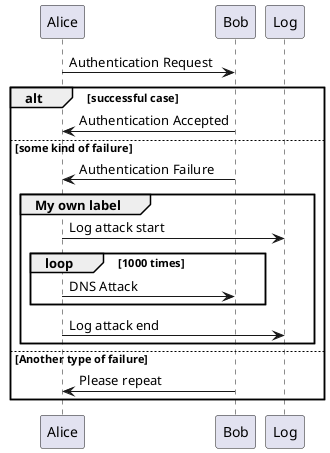
````

官方渲染效果：

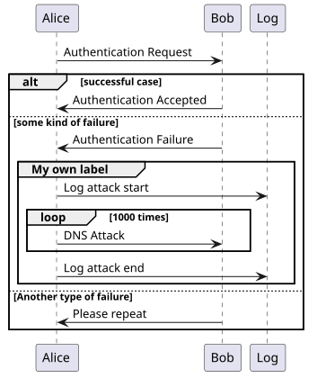

建议检查文本：`successful case`, `Authentication Accepted`, `DNS Attack`, `Another type of failure`

#### plantuml-sequence-participants: Sequence diagram with participant declarations and return arrow

官方来源：https://plantuml.com/sequence-diagram

官方渲染 URL：https://www.plantuml.com/plantuml/svg/LOwnYiCm341tVuN87cxFK9gG63ATQNiVe5ZYpZIHYwpyVucl7Re9lSUJpiLGRTzMXz6omazXTGzKIp4zK0mQhrcCXHh00dxwX0F6Emj17-RA-p0xGiC52qCplgQAni6vemxj2VpKmNLVjcGGbOd54gx5-Uc0VPWx2D_N6toj-JU9wyDyxCUX0v-4O3z-70TettBDAiUiz2-_JbY-izHgUwfI1nUcf1mDB0DX-LioAhap2-tR-WG0

代码（复制下面整个 fenced code block 到 Supramark 中测试）：

````markdown
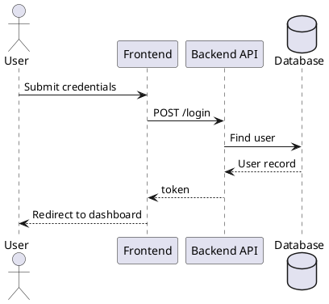
````

官方渲染效果：

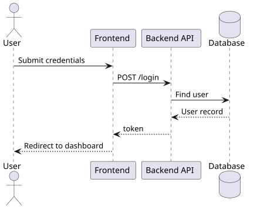

建议检查文本：`User`, `Frontend`, `Backend API`, `Database`, `token`

### 类图示例

#### plantuml-class-relations: PlantUML class diagram with cardinality and labels

官方来源：https://plantuml.com/class-diagram

官方渲染 URL：https://www.plantuml.com/plantuml/svg/BOox2i0W40JxVCLY6JZ8kx08GhxaI4G2UaBK8dyVY9OxCwn9cPzSWkyEpoaD8zIeq1D11PPNeU896cUKpBUaLiw8H4qlq63d7kiutr5QiO9e___gtZfZvIh1Vm00

代码（复制下面整个 fenced code block 到 Supramark 中测试）：

````markdown
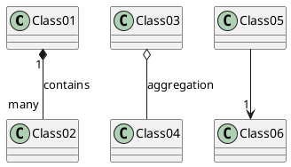
````

官方渲染效果：

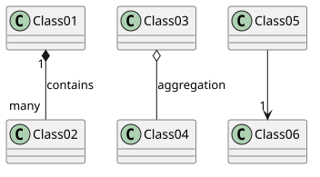

建议检查文本：`Class01`, `Class02`, `contains`, `many`, `aggregation`

#### plantuml-class-members: Class diagram with attributes, methods, abstract class, and interface

官方来源：https://plantuml.com/class-diagram

官方渲染 URL：https://www.plantuml.com/plantuml/svg/DOrD3e8m48NtFSKi8GPEm0AZSUVA4qnh8Ksd9NQc8KIykw7LtSlt_aOMJ983ATGi2Os08MI6StG12TuAuEIY0CwsIBvZ24XDgpxAHR5fGcFXHXjgiZK-qLRiEdJDnbV-aEJY3DgYlooqf8FnwaBJ7kgLqVZI-rqFUzULjlgl3tlVLpBQ-Co1lW00

代码（复制下面整个 fenced code block 到 Supramark 中测试）：

````markdown
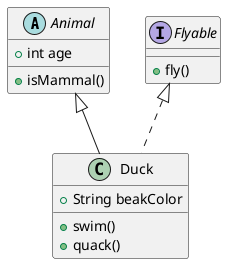
````

官方渲染效果：

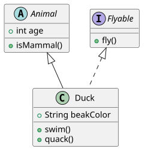

建议检查文本：`Animal`, `Duck`, `Flyable`, `age`, `quack`

#### plantuml-class-packages: Class diagram with packages and dependencies

官方来源：https://plantuml.com/class-diagram

官方渲染 URL：https://www.plantuml.com/plantuml/svg/LOrB2i9044JtVOec-rmW2mbu0yK3j9D61kT7TuyY8NUN276IPV7gLOrg95PZW4BkIG_6xitt3cT0T85KyPoJIGw11PPMcd8ad_QzAylBE_xdcnwDmg9UZPFZlNRXajLRbWyiqBwmxq_R90vObHMskAAcuO32D1tnUlu3LYKfZ9oc6iCN

代码（复制下面整个 fenced code block 到 Supramark 中测试）：

````markdown
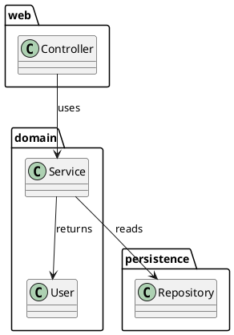
````

官方渲染效果：

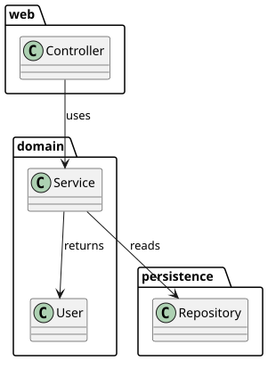

建议检查文本：`Controller`, `Service`, `Repository`, `User`, `uses`

### 活动图示例

#### plantuml-activity-conditional: PlantUML activity diagram with conditional branch

官方来源：https://plantuml.com/activity-diagram-beta

官方渲染 URL：https://www.plantuml.com/plantuml/svg/LSmn3i8m343HFQVms5u11hfn2IJBQbngoN52x5OAfqTYWkqFJt_ne1v7qVID91jCzqvjF-KDOXwaolasG-niC0tsEG5SMgyhkmEfFYmBFJiLloPMPvYi_fbgEW3H-NMmhOm8P1aGQGqv9GOY_1miovOyQaiBMpwAVW00

代码（复制下面整个 fenced code block 到 Supramark 中测试）：

````markdown
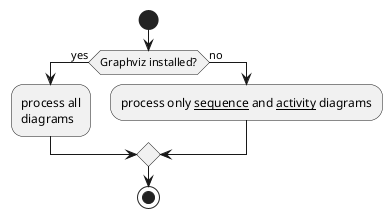
````

官方渲染效果：

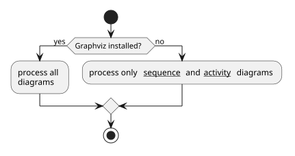

建议检查文本：`Graphviz installed?`, `process all`, `sequence`, `activity`

#### plantuml-activity-repeat: Activity diagram with repeat loop

官方来源：https://plantuml.com/activity-diagram-beta

官方渲染 URL：https://www.plantuml.com/plantuml/svg/BSfB2eH034NHULQHeGvw0nQeMqbJ3ose7qcAfdSlYhDxuUpceZvAfYT8qI5Ep8j28aTn2VSTg51nS4nog1GBB-NVcJ9uAatny6tcP3pzOJDzLgujqDB7DoSxMT6RUY3prcb7ZQFa2m00

代码（复制下面整个 fenced code block 到 Supramark 中测试）：

````markdown
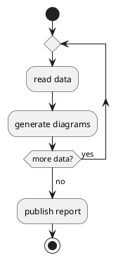
````

官方渲染效果：

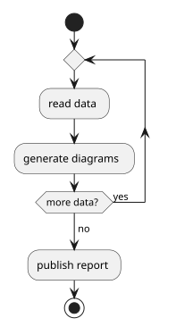

建议检查文本：`read data`, `generate diagrams`, `more data?`, `publish report`

#### plantuml-activity-partitions: Activity diagram with partitions and synchronization

官方来源：https://plantuml.com/activity-diagram-beta

官方渲染 URL：https://www.plantuml.com/plantuml/svg/TOx12i8m44Jl-OhzZdef-0DYmNiaeomccxgxwKNwxv8Mr8ktOURncD4yghUImnR27DNPkGeTCqESNe5ecDgri9FYsM1-2EiFDq4NwCvTOkOK7L-Iw5Rr4OY8XXFKsBh6Mlvi5E-HPIScIABO4ZjXWMnChpR7-kVS6PAWtJfNCVHtvdKE8oIrajy0

代码（复制下面整个 fenced code block 到 Supramark 中测试）：

````markdown
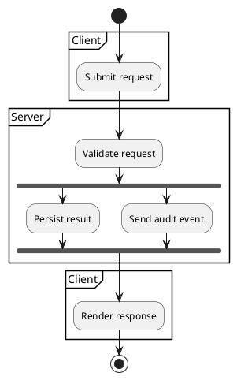
````

官方渲染效果：

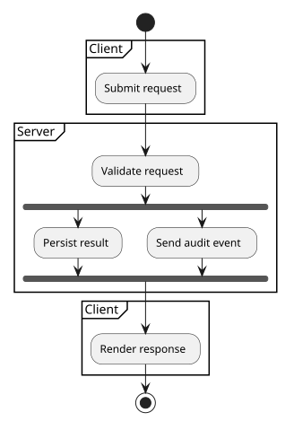

建议检查文本：`Client`, `Server`, `Validate request`, `Persist result`, `Render response`

## Mermaid

### 流程图

#### mermaid-flowchart-decision: Mermaid flowchart with decision loop and labeled edges

官方来源：https://mermaid.js.org/syntax/flowchart.html

官方渲染器版本：Mermaid 11.16.0

代码（复制下面整个 fenced code block 到 Supramark 中测试）：

````markdown
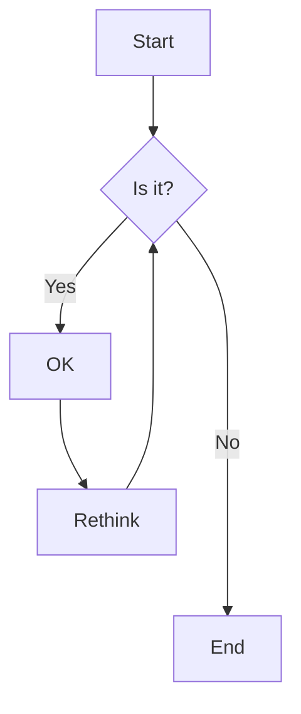
````

官方渲染效果：


建议检查文本：`Start`, `Is it?`, `OK`, `Rethink`, `End`

#### mermaid-flowchart-shapes: Mermaid flowchart with common node shapes

官方来源：https://mermaid.js.org/syntax/flowchart.html

官方渲染器版本：Mermaid 11.16.0

代码（复制下面整个 fenced code block 到 Supramark 中测试）：

````markdown
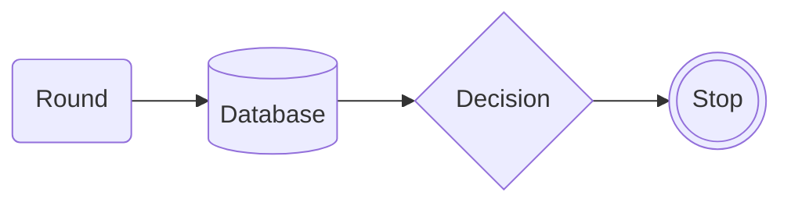
````

官方渲染效果：


建议检查文本：`Round`, `Database`, `Decision`, `Stop`

#### mermaid-flowchart-subgraph: Mermaid flowchart with subgraphs and cross-group edges

官方来源：https://mermaid.js.org/syntax/flowchart.html

官方渲染器版本：Mermaid 11.16.0

代码（复制下面整个 fenced code block 到 Supramark 中测试）：

````markdown
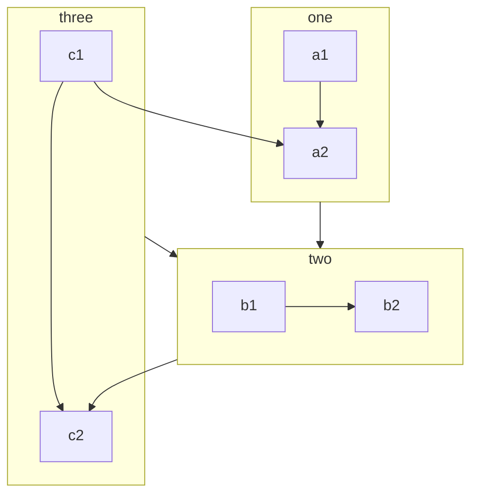
````

官方渲染效果：


建议检查文本：`one`, `two`, `three`, `a1`, `b1`, `c1`

## DOT / Graphviz

### 有向图

#### graphviz-fsm: Finite automaton with accepting states and labeled transitions

官方来源：https://graphviz.org/Gallery/directed/fsm.html

官方源码：https://graphviz.org/Gallery/directed/fsm.gv.txt
官方渲染 URL：https://graphviz.org/Gallery/directed/fsm.svg

代码（复制下面整个 fenced code block 到 Supramark 中测试）：
````markdown
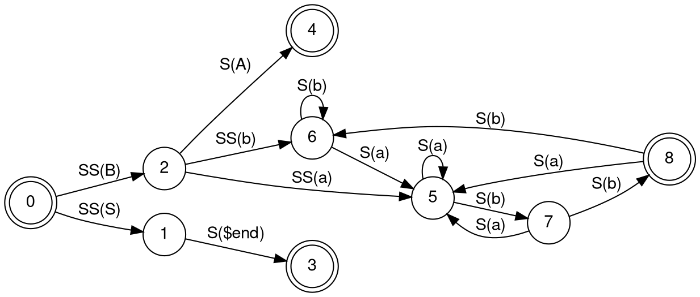
````

官方渲染效果：


建议检查文本：`finite_state_machine`, `SS(B)`, `S($end)`, `S(a)`, `8`

#### graphviz-cluster: Clustered process graph with cross-cluster edges

官方来源：https://graphviz.org/Gallery/directed/cluster.html

官方源码：https://graphviz.org/Gallery/directed/cluster.gv.txt
官方渲染 URL：https://graphviz.org/Gallery/directed/cluster.svg

代码（复制下面整个 fenced code block 到 Supramark 中测试）：
````markdown
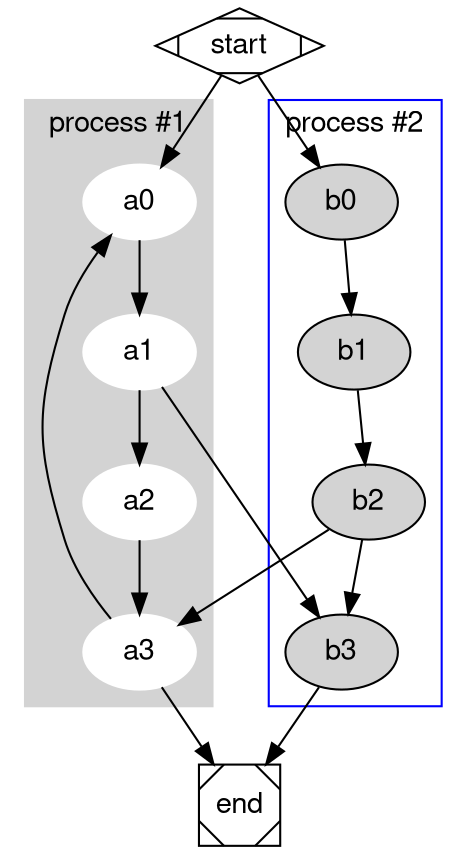
````

官方渲染效果：
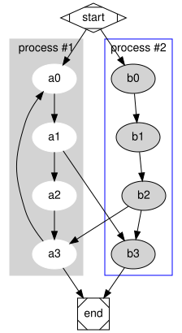

建议检查文本：`process #1`, `process #2`, `start`, `end`, `a3`

#### graphviz-datastruct: Record-shaped data structure graph

官方来源：https://graphviz.org/Gallery/directed/datastruct.html

官方源码：https://graphviz.org/Gallery/directed/datastruct.gv.txt
官方渲染 URL：https://graphviz.org/Gallery/directed/datastruct.svg

代码（复制下面整个 fenced code block 到 Supramark 中测试）：
````markdown
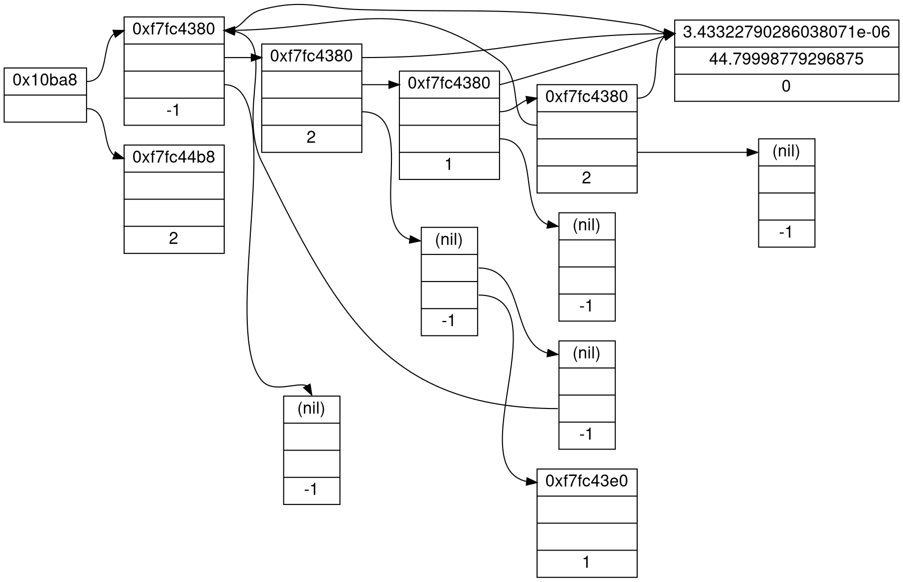
````

官方渲染效果：
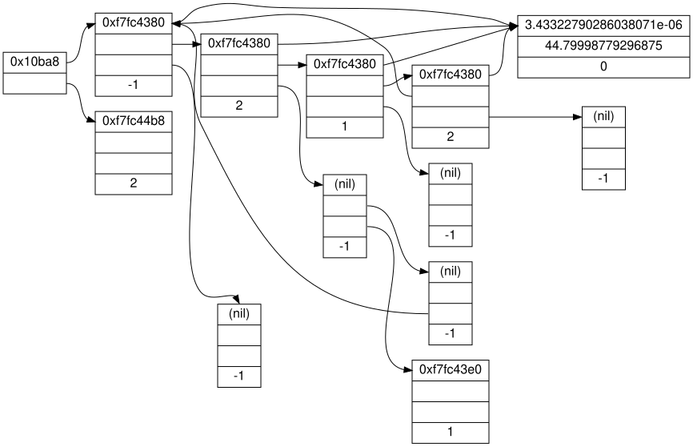

建议检查文本：`0x10ba8`, `0xf7fc4380`, `0xf7fc44b8`, `(nil)`, `44.79998779296875`


## ECharts

### 折线图

#### echarts-line-simple: Basic line chart with category axis

官方来源：https://echarts.apache.org/examples/en/editor.html?c=line-simple&renderer=svg

官方源码（JS option）：https://echarts.apache.org/examples/en/editor.html?c=line-simple&renderer=svg
官方渲染 URL：https://echarts.apache.org/examples/en/editor.html?c=line-simple&renderer=svg
官方渲染器版本：Apache ECharts 6.1.0（官网 editor iframe 中暴露的 `echarts.version`）

说明：Supramark 的 ECharts engine 解析 JSON，因此这里使用从官方 JS `option` 等价转换出的 JSON。

代码（复制下面整个 fenced code block 到 Supramark 中测试）：
````markdown
```echarts
{
  "xAxis": {
    "type": "category",
    "data": [
      "Mon",
      "Tue",
      "Wed",
      "Thu",
      "Fri",
      "Sat",
      "Sun"
    ]
  },
  "yAxis": {
    "type": "value"
  },
  "series": [
    {
      "data": [
        150,
        230,
        224,
        218,
        135,
        147,
        260
      ],
      "type": "line"
    }
  ]
}
```
````

官方渲染效果：
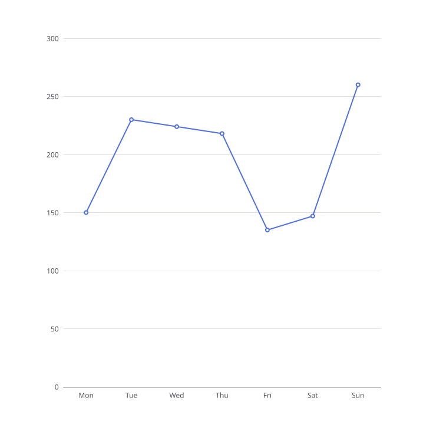

建议检查文本：`Mon`, `Tue`, `Sun`, `150`, `260`

#### echarts-line-smooth: Smooth line chart

官方来源：https://echarts.apache.org/examples/en/editor.html?c=line-smooth&renderer=svg

官方源码（JS option）：https://echarts.apache.org/examples/en/editor.html?c=line-smooth&renderer=svg
官方渲染 URL：https://echarts.apache.org/examples/en/editor.html?c=line-smooth&renderer=svg
官方渲染器版本：Apache ECharts 6.1.0（官网 editor iframe 中暴露的 `echarts.version`）

说明：Supramark 的 ECharts engine 解析 JSON，因此这里使用从官方 JS `option` 等价转换出的 JSON。

代码（复制下面整个 fenced code block 到 Supramark 中测试）：
````markdown
```echarts
{
  "xAxis": {
    "type": "category",
    "data": [
      "Mon",
      "Tue",
      "Wed",
      "Thu",
      "Fri",
      "Sat",
      "Sun"
    ]
  },
  "yAxis": {
    "type": "value"
  },
  "series": [
    {
      "data": [
        820,
        932,
        901,
        934,
        1290,
        1330,
        1320
      ],
      "type": "line",
      "smooth": true
    }
  ]
}
```
````

官方渲染效果：
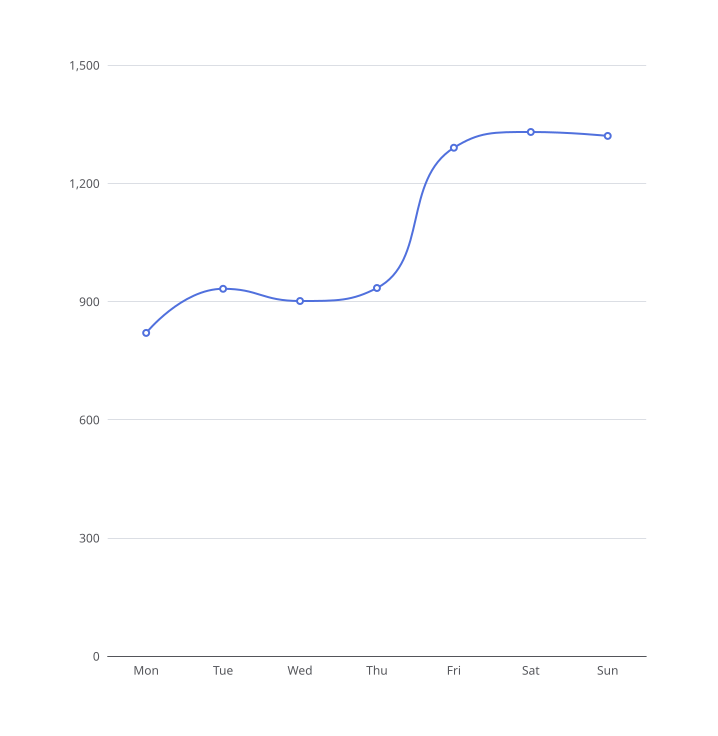

建议检查文本：`Mon`, `Tue`, `Sun`, `smooth`, `820`

#### echarts-line-stack: Stacked multi-series line chart

官方来源：https://echarts.apache.org/examples/en/editor.html?c=line-stack&renderer=svg

官方源码（JS option）：https://echarts.apache.org/examples/en/editor.html?c=line-stack&renderer=svg
官方渲染 URL：https://echarts.apache.org/examples/en/editor.html?c=line-stack&renderer=svg
官方渲染器版本：Apache ECharts 6.1.0（官网 editor iframe 中暴露的 `echarts.version`）

说明：Supramark 的 ECharts engine 解析 JSON，因此这里使用从官方 JS `option` 等价转换出的 JSON。

代码（复制下面整个 fenced code block 到 Supramark 中测试）：
````markdown
```echarts
{
  "title": {
    "text": "Stacked Line"
  },
  "tooltip": {
    "trigger": "axis"
  },
  "legend": {
    "data": [
      "Email",
      "Union Ads",
      "Video Ads",
      "Direct",
      "Search Engine"
    ]
  },
  "grid": {
    "left": "3%",
    "right": "4%",
    "bottom": "3%",
    "containLabel": true
  },
  "toolbox": {
    "feature": {
      "saveAsImage": {}
    }
  },
  "xAxis": {
    "type": "category",
    "boundaryGap": false,
    "data": [
      "Mon",
      "Tue",
      "Wed",
      "Thu",
      "Fri",
      "Sat",
      "Sun"
    ]
  },
  "yAxis": {
    "type": "value"
  },
  "series": [
    {
      "name": "Email",
      "type": "line",
      "stack": "Total",
      "data": [
        120,
        132,
        101,
        134,
        90,
        230,
        210
      ]
    },
    {
      "name": "Union Ads",
      "type": "line",
      "stack": "Total",
      "data": [
        220,
        182,
        191,
        234,
        290,
        330,
        310
      ]
    },
    {
      "name": "Video Ads",
      "type": "line",
      "stack": "Total",
      "data": [
        150,
        232,
        201,
        154,
        190,
        330,
        410
      ]
    },
    {
      "name": "Direct",
      "type": "line",
      "stack": "Total",
      "data": [
        320,
        332,
        301,
        334,
        390,
        330,
        320
      ]
    },
    {
      "name": "Search Engine",
      "type": "line",
      "stack": "Total",
      "data": [
        820,
        932,
        901,
        934,
        1290,
        1330,
        1320
      ]
    }
  ]
}
```
````

官方渲染效果：
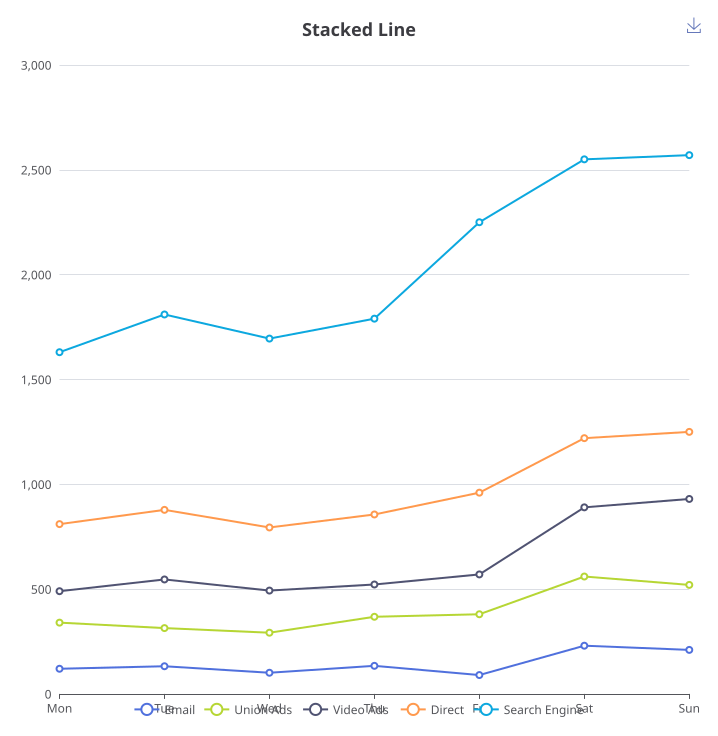

建议检查文本：`Stacked Line`, `Email`, `Union Ads`, `Search Engine`, `Total`


## Vega-Lite

### 柱状图

#### vega-lite-bar-simple: Simple bar chart with embedded data

官方来源：https://vega.github.io/vega-lite/examples/bar.html

官方源码（Vega-Lite JSON Specification）：https://vega.github.io/vega-lite/examples/bar.html
官方渲染 URL：https://vega.github.io/vega-lite/examples/bar.html
官方渲染器版本：Vega-Lite v6 schema（官方 example 页面 JSON 中的 `$schema`）

说明：若官方 spec 使用 `data/...` 相对数据路径，这里展开为 `https://vega.github.io/vega-lite/data/...`，避免粘到 Supramark 页面后按 Supramark 域名解析导致数据 404。

代码（复制下面整个 fenced code block 到 Supramark 中测试）：
````markdown
```vega-lite
{
  "$schema": "https://vega.github.io/schema/vega-lite/v6.json",
  "description": "A simple bar chart with embedded data.",
  "data": {
    "values": [
      {
        "a": "A",
        "b": 28
      },
      {
        "a": "B",
        "b": 55
      },
      {
        "a": "C",
        "b": 43
      },
      {
        "a": "D",
        "b": 91
      },
      {
        "a": "E",
        "b": 81
      },
      {
        "a": "F",
        "b": 53
      },
      {
        "a": "G",
        "b": 19
      },
      {
        "a": "H",
        "b": 87
      },
      {
        "a": "I",
        "b": 52
      }
    ]
  },
  "mark": "bar",
  "encoding": {
    "x": {
      "field": "a",
      "type": "nominal",
      "axis": {
        "labelAngle": 0
      }
    },
    "y": {
      "field": "b",
      "type": "quantitative"
    }
  }
}
```
````

官方渲染效果：
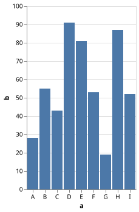

建议检查文本：`A`, `B`, `I`, `b`, `bar`

#### vega-lite-bar-aggregate: Aggregate bar chart

官方来源：https://vega.github.io/vega-lite/examples/bar_aggregate.html

官方源码（Vega-Lite JSON Specification）：https://vega.github.io/vega-lite/examples/bar_aggregate.html
官方渲染 URL：https://vega.github.io/vega-lite/examples/bar_aggregate.html
官方渲染器版本：Vega-Lite v6 schema（官方 example 页面 JSON 中的 `$schema`）

说明：若官方 spec 使用 `data/...` 相对数据路径，这里展开为 `https://vega.github.io/vega-lite/data/...`，避免粘到 Supramark 页面后按 Supramark 域名解析导致数据 404。

代码（复制下面整个 fenced code block 到 Supramark 中测试）：
````markdown
```vega-lite
{
  "$schema": "https://vega.github.io/schema/vega-lite/v6.json",
  "description": "A bar chart showing the US population distribution of age groups in 2000.",
  "height": {
    "step": 17
  },
  "data": {
    "url": "https://vega.github.io/vega-lite/data/population.json"
  },
  "transform": [
    {
      "filter": "datum.year == 2000"
    }
  ],
  "mark": "bar",
  "encoding": {
    "y": {
      "field": "age"
    },
    "x": {
      "aggregate": "sum",
      "field": "people",
      "title": "population"
    }
  }
}
```
````

官方渲染效果：
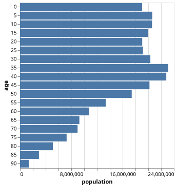

建议检查文本：`aggregate`, `count`, `bar`

#### vega-lite-bar-grouped: Grouped bar chart

官方来源：https://vega.github.io/vega-lite/examples/bar_grouped.html

官方源码（Vega-Lite JSON Specification）：https://vega.github.io/vega-lite/examples/bar_grouped.html
官方渲染 URL：https://vega.github.io/vega-lite/examples/bar_grouped.html
官方渲染器版本：Vega-Lite v6 schema（官方 example 页面 JSON 中的 `$schema`）

说明：若官方 spec 使用 `data/...` 相对数据路径，这里展开为 `https://vega.github.io/vega-lite/data/...`，避免粘到 Supramark 页面后按 Supramark 域名解析导致数据 404。

代码（复制下面整个 fenced code block 到 Supramark 中测试）：
````markdown
```vega-lite
{
  "$schema": "https://vega.github.io/schema/vega-lite/v6.json",
  "data": {
    "values": [
      {
        "category": "A",
        "group": "x",
        "value": 0.1
      },
      {
        "category": "A",
        "group": "y",
        "value": 0.6
      },
      {
        "category": "A",
        "group": "z",
        "value": 0.9
      },
      {
        "category": "B",
        "group": "x",
        "value": 0.7
      },
      {
        "category": "B",
        "group": "y",
        "value": 0.2
      },
      {
        "category": "B",
        "group": "z",
        "value": 1.1
      },
      {
        "category": "C",
        "group": "x",
        "value": 0.6
      },
      {
        "category": "C",
        "group": "y",
        "value": 0.1
      },
      {
        "category": "C",
        "group": "z",
        "value": 0.2
      }
    ]
  },
  "mark": "bar",
  "encoding": {
    "x": {
      "field": "category"
    },
    "y": {
      "field": "value",
      "type": "quantitative"
    },
    "xOffset": {
      "field": "group"
    },
    "color": {
      "field": "group"
    }
  }
}
```
````

官方渲染效果：
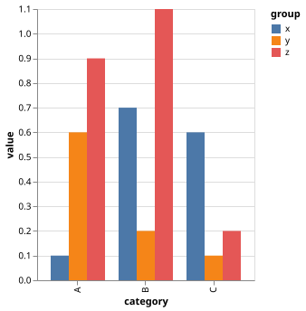

建议检查文本：`category`, `group`, `value`, `xOffset`, `color`
